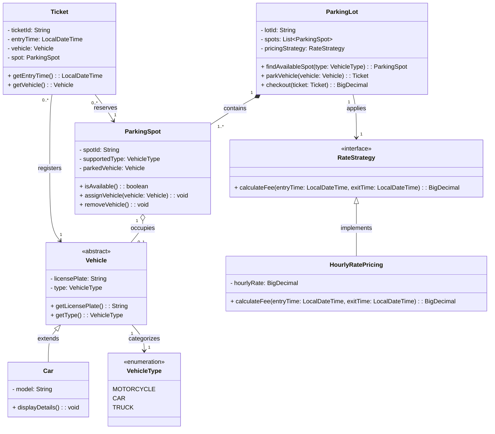

# UML Class Diagram Relationships Cheat Sheet

This document defines the standard notations for Class Diagrams, including visibility, multiplicity, relationships.

## 1. Visibility Modifiers
Visibility defines which other classes can "see" or access an attribute or method.

| Symbol | Name | Description |
| :--- | :--- | :--- |
| `+` | **Public** | Accessible by any other class. |
| `-` | **Private** | Accessible only within the same class. |
| `#` | **Protected** | Accessible by the class and its subclasses (Inheritance). |
| `~` | **Package** | Accessible by any class within the same package. |

---

## 2. Multiplicity
Multiplicity indicates how many instances of one class are linked to one instance of another class.

| Notation | Meaning |
| :--- | :--- |
| `1` | Exactly one |
| `0..1` | Zero or one (Optional) |
| `*` | Many (Zero or more) |
| `1..*` | One or more (At least one) |
| `m..n` | A specific range (e.g., `2..4`) |

---

## 3. Relationships

#### 1. Generalization (Inheritance)
**The "is-a" relationship.** Use this when a subclass inherits all attributes and methods from a parent class.
* **Line:** Solid
* **Arrowhead:** Hollow, closed triangle (pointing to the Parent)
* **Example:** `Car` —▷ `Vehicle`

#### 2. Realization (Implementation)
**The "can-do" relationship.** Use this when a class implements the behavior defined in an interface.
* **Line:** Dashed
* **Arrowhead:** Hollow, closed triangle (pointing to the Interface)
* **Example:** `Printer` ---▷ `Printable`

#### 3. Association
**The "knows-about" relationship.** A structural connection where one class has a reference to another as an attribute.
* **Line:** Solid
* **Arrowhead:** None (Bi-directional) or an Open Arrow `>` (Unidirectional)
* **Example:** `Customer` — `Order`

#### 4. Aggregation
**The "has-a" relationship (Weak).** A collection where the "part" can exist independently of the "whole."
* **Line:** Solid
* **Arrowhead:** Hollow diamond (at the "Whole/Container" side)
* **Example:** `Library` ◇— `Book` (If the library closes, the book still exists)

#### 5. Composition
**The "owns-a" relationship (Strong).** A strict ownership where the "part" cannot exist without the "whole."
* **Line:** Solid
* **Arrowhead:** Filled (Solid) diamond (at the "Whole/Owner" side)
* **Example:** `Building` ◆— `Room` (If the building is destroyed, the rooms are gone)

#### 6. Dependency
**The "uses-a" relationship (Temporary).** A brief interaction where one class uses another as a local variable or parameter inside a method.
* **Line:** Dashed
* **Arrowhead:** Open arrow `>`
* **Example:** `DataProcessor` ---> `FileReader`

#### Summary Table

| Relationship | Line Type | Arrow/Diamond Style | Meaning |
| :--- | :--- | :--- | :--- |
| **Generalization** | Solid | Hollow Triangle | Inheritance |
| **Realization** | Dashed | Hollow Triangle | Interface Implementation |
| **Composition** | Solid | **Solid Diamond** | Strong Ownership (Part dies with Whole) |
| **Aggregation** | Solid | **Hollow Diamond** | Collection (Part lives on) |
| **Association** | Solid | None / Open Arrow | Structural link / Reference |
| **Dependency** | Dashed | Open Arrow | Temporary usage |

---

## Quick Tips for Drawing
1.  **Direction:** Arrows and diamonds always point toward the "Parent," "Interface," or "Owner."
2.  **Multiplicity:** Always write your numbers (e.g., `1`, `0..*`, `*`) at the ends of the lines for Associations, Aggregations, and Compositions.
3.  **Consistency:** Use a hollow triangle for any "is-a" logic, and a diamond for "has-a" logic.

## Sample Class Diagram for Parking Lot System

