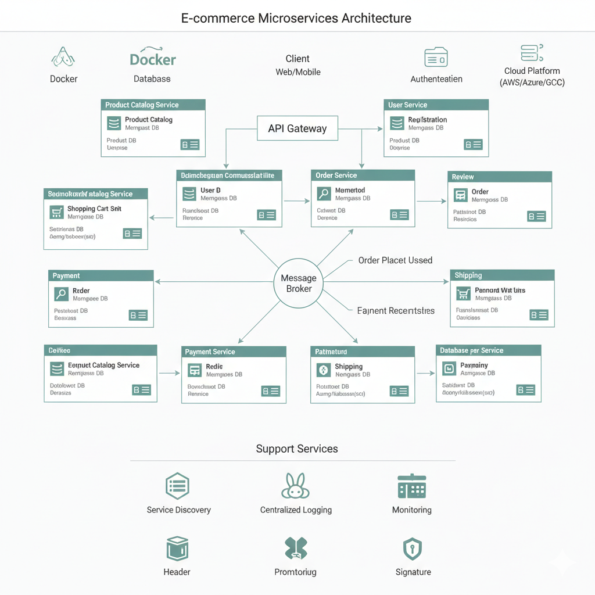

# Month 3: Advanced Algorithms, Spring Boot & Database, and Mock Interviews - Indexed Solutions

## Week 11: Advanced Algorithms and Data Structures

### Topic 1: Heaps, Priority Queues, and Hash Tables (Revisited)

#### Interview Questions & Answers:

1.  **What is a Heap? Explain Min-Heap and Max-Heap.**
    *   **Answer:** A Heap is a specialized tree-based data structure that satisfies the heap property. In a **Min-Heap**, for any given node `i`, the value of node `i` is less than or equal to the values of its children. The smallest element is always at the root. In a **Max-Heap**, for any given node `i`, the value of node `i` is greater than or equal to the values of its children. The largest element is always at the root. Both are typically implemented using an array, leveraging the parent-child index relationship.

2.  **How is `PriorityQueue` implemented in Java?**
    *   **Answer:** Java's `PriorityQueue` is implemented as a min-heap using an array-based binary heap. It does not allow `null` elements. Elements are ordered according to their natural ordering or by a `Comparator` provided at queue construction time. Operations like `add()` and `poll()` have an average time complexity of O(log n).

3.  **Give use cases for `PriorityQueue`.**
    *   **Answer:**
        *   Implementing Dijkstra's algorithm for shortest paths.
        *   Implementing Prim's and Kruskal's algorithms for Minimum Spanning Trees.
        *   Finding the Kth smallest/largest element in a stream or array.
        *   Task scheduling, where tasks with higher priority are executed first.
        *   Merging K sorted lists/arrays.
        *   Huffman coding.

4.  **Explain the importance of `load factor` in `HashMap`.**
    *   **Answer:** The `load factor` in `HashMap` (default 0.75) is a measure that determines when the hash map should be resized (rehashed). When the number of entries in the map exceeds (`capacity * load_factor`), the map is resized to approximately double its capacity, and all existing elements are rehashed into the new, larger array. A low load factor reduces collisions but increases space complexity. A high load factor saves space but increases the likelihood of collisions, leading to poorer performance (O(n) in worst-case for `get`/`put` if too many collisions).

5.  **How do `TreeMap` and `LinkedHashMap` differ in their internal structure and use cases?**
    *   **Answer:**
        *   **`TreeMap`:** Implemented using a Red-Black Tree. It stores elements in a sorted order (natural ordering of keys or by a custom `Comparator`). Provides O(log n) time complexity for `get`, `put`, `remove`. Useful when you need ordered key-value pairs, range queries, or to find the nearest key.
        *   **`LinkedHashMap`:** Implemented as a hash table with a doubly-linked list running through its entries. It maintains insertion order (or access order if configured). Provides O(1) average time complexity for `get`, `put`, `remove`. Useful for implementing LRU (Least Recently Used) caches or when iteration order needs to be predictable based on insertion.

#### Practice Questions & Solutions:

1.  **Find the Kth smallest element in an array using a `Min-Heap`.**

    ```java
    import java.util.PriorityQueue;

    public class KthSmallest {
        public int findKthSmallest(int[] nums, int k) {
            if (k < 1 || k > nums.length) {
                throw new IllegalArgumentException("Invalid k value");
            }

            PriorityQueue<Integer> minHeap = new PriorityQueue<>();
            for (int num : nums) {
                minHeap.add(num);
            }

            // Poll k-1 times to remove the smallest elements
            for (int i = 0; i < k - 1; i++) {
                minHeap.poll();
            }

            // The next poll will give the Kth smallest element
            return minHeap.poll();
        }

        // Alternative: Using a Max-Heap of size K (more efficient for large arrays)
        public int findKthSmallestUsingMaxHeap(int[] nums, int k) {
            if (k < 1 || k > nums.length) {
                throw new IllegalArgumentException("Invalid k value");
            }

            PriorityQueue<Integer> maxHeap = new PriorityQueue<>((a, b) -> b - a); // Max-Heap
            for (int num : nums) {
                maxHeap.add(num);
                if (maxHeap.size() > k) {
                    maxHeap.poll(); // Remove the largest element if heap size exceeds k
                }
            }
            return maxHeap.peek(); // The root of the max-heap is the Kth smallest
        }
    }
    ```
    *   **Explanation:** The first method inserts all elements into a min-heap and then extracts the smallest `k` elements. The `k`-th element extracted is the answer. The second, more efficient method, uses a max-heap of size `k`. It iterates through the array, adding elements to the heap. If the heap size exceeds `k`, the largest element (root of max-heap) is removed. This ensures the heap always contains the `k` smallest elements seen so far, with the largest of these (the k-th smallest overall) at the root.
    *   **Time Complexity:** O(N log K) for the max-heap approach (N insertions/updates, each log K). O(N log N) for the min-heap approach (N insertions, then K polls).
    *   **Space Complexity:** O(K) for the max-heap approach. O(N) for the min-heap approach.

2.  **Merge K sorted lists using a `Min-Heap`.**

    ```java
    import java.util.PriorityQueue;
    import java.util.ArrayList;
    import java.util.List;

    public class MergeKSortedLists {
        // Definition for singly-linked list.
        public static class ListNode {
            int val;
            ListNode next;
            ListNode(int val) { this.val = val; }
        }

        public ListNode mergeKLists(ListNode[] lists) {
            if (lists == null || lists.length == 0) {
                return null;
            }

            // Min-Heap to store the current node from each list
            PriorityQueue<ListNode> minHeap = new PriorityQueue<>((n1, n2) -> n1.val - n2.val);

            // Add the head of each list to the min-heap
            for (ListNode list : lists) {
                if (list != null) {
                    minHeap.add(list);
                }
            }

            ListNode dummyHead = new ListNode(0);
            ListNode current = dummyHead;

            while (!minHeap.isEmpty()) {
                ListNode smallest = minHeap.poll(); // Get the smallest element
                current.next = smallest;
                current = current.next;

                if (smallest.next != null) {
                    minHeap.add(smallest.next); // Add the next element from the same list
                }
            }
            return dummyHead.next;
        }
    }
    ```
    *   **Explanation:** We use a min-heap to keep track of the smallest element from the *heads* of all `k` lists. Initially, we add the first node of each non-empty list to the heap. Then, in a loop, we extract the smallest node from the heap, add it to our result list, and if that node has a `next` element, we add `next` to the heap. This ensures that the heap always contains the next available smallest element across all lists.
    *   **Time Complexity:** O(N log K), where N is the total number of elements across all lists and K is the number of lists. Each element is added to and removed from the heap once.
    *   **Space Complexity:** O(K) for the heap, as it stores at most one node from each of the K lists.

3.  **Implement a `Max-Heap` from scratch (optional, but good for understanding).**

    ```java
    import java.util.ArrayList;
    import java.util.List;
    import java.util.NoSuchElementException;

    public class MyMaxHeap {
        private List<Integer> heap;

        public MyMaxHeap() {
            heap = new ArrayList<>();
        }

        public boolean isEmpty() {
            return heap.isEmpty();
        }

        public int size() {
            return heap.size();
        }

        // Helper methods for parent/child indices
        private int getParentIndex(int i) { return (i - 1) / 2; }
        private int getLeftChildIndex(int i) { return 2 * i + 1; }
        private int getRightChildIndex(int i) { return 2 * i + 2; }

        private boolean hasParent(int i) { return getParentIndex(i) >= 0; }
        private boolean hasLeftChild(int i) { return getLeftChildIndex(i) < heap.size(); }
        private boolean hasRightChild(int i) { return getRightChildIndex(i) < heap.size(); }

        private int parent(int i) { return heap.get(getParentIndex(i)); }
        private int leftChild(int i) { return heap.get(getLeftChildIndex(i)); }
        private int rightChild(int i) { return heap.get(getRightChildIndex(i)); }

        // Swap utility
        private void swap(int i, int j) {
            int temp = heap.get(i);
            heap.set(i, heap.get(j));
            heap.set(j, temp);
        }

        // Insert an element
        public void insert(int item) {
            heap.add(item);
            heapifyUp(); // Maintain heap property by moving the new element up
        }

        // Peek the maximum element
        public int peek() {
            if (isEmpty()) {
                throw new NoSuchElementException("Heap is empty");
            }
            return heap.get(0);
        }

        // Extract the maximum element
        public int extractMax() {
            if (isEmpty()) {
                throw new NoSuchElementException("Heap is empty");
            }
            int max = heap.get(0);
            int lastElement = heap.remove(heap.size() - 1); // Remove last element
            if (!heap.isEmpty()) {
                heap.set(0, lastElement); // Replace root with last element
                heapifyDown(); // Maintain heap property by moving the new root down
            }
            return max;
        }

        // Move element up to maintain heap property
        private void heapifyUp() {
            int index = heap.size() - 1;
            while (hasParent(index) && parent(index) < heap.get(index)) {
                swap(index, getParentIndex(index));
                index = getParentIndex(index);
            }
        }

        // Move element down to maintain heap property
        private void heapifyDown() {
            int index = 0;
            while (hasLeftChild(index)) { // Check only left child, if it has a right, we check later
                int largerChildIndex = getLeftChildIndex(index);
                if (hasRightChild(index) && rightChild(index) > leftChild(index)) {
                    largerChildIndex = getRightChildIndex(index);
                }

                if (heap.get(index) < heap.get(largerChildIndex)) {
                    swap(index, largerChildIndex);
                } else {
                    break; // Heap property satisfied
                }
                index = largerChildIndex;
            }
        }

        public static void main(String[] args) {
            MyMaxHeap maxHeap = new MyMaxHeap();
            maxHeap.insert(10);
            maxHeap.insert(5);
            maxHeap.insert(20);
            maxHeap.insert(3);
            maxHeap.insert(25);

            System.out.println("Max element: " + maxHeap.peek()); // Expected: 25

            System.out.print("Elements extracted: ");
            while (!maxHeap.isEmpty()) {
                System.out.print(maxHeap.extractMax() + " "); // Expected: 25 20 10 5 3
            }
            System.out.println();
        }
    }
    ```
    *   **Explanation:** A max-heap stores elements such that the parent is always greater than or equal to its children.
        *   `insert()`: Adds the new element to the end of the array (bottom-most, right-most position) and then `heapifyUp()` to restore the heap property by repeatedly swapping the element with its parent if it's larger.
        *   `extractMax()`: Removes the root (maximum element), replaces it with the last element in the array, removes the last element, and then `heapifyDown()` to restore the heap property by repeatedly swapping the new root with its larger child until it's in the correct position.
    *   **Time Complexity:** O(log N) for `insert` and `extractMax`. O(1) for `peek`.
    *   **Space Complexity:** O(N) for storing the heap elements.

4.  **Given a stream of numbers, find the median at any point (using two heaps).**

    ```java
    import java.util.PriorityQueue;
    import java.util.Collections; // For max-heap

    public class MedianFinder {
        // maxHeap stores the smaller half of the numbers
        // minHeap stores the larger half of the numbers
        private PriorityQueue<Integer> maxHeap; // For lower half
        private PriorityQueue<Integer> minHeap; // For upper half

        public MedianFinder() {
            maxHeap = new PriorityQueue<>(Collections.reverseOrder()); // Max-heap
            minHeap = new PriorityQueue<>(); // Min-heap
        }

        public void addNum(int num) {
            if (maxHeap.isEmpty() || num <= maxHeap.peek()) {
                maxHeap.add(num);
            } else {
                minHeap.add(num);
            }

            // Balance the heaps: ensure maxHeap.size() == minHeap.size() or maxHeap.size() == minHeap.size() + 1
            if (maxHeap.size() > minHeap.size() + 1) {
                minHeap.add(maxHeap.poll());
            } else if (minHeap.size() > maxHeap.size()) {
                maxHeap.add(minHeap.poll());
            }
        }

        public double findMedian() {
            if (maxHeap.isEmpty()) {
                throw new IllegalStateException("No numbers added yet.");
            }

            if (maxHeap.size() == minHeap.size()) {
                // Even number of elements, median is average of two middle elements
                return (maxHeap.peek() + minHeap.peek()) / 2.0;
            } else {
                // Odd number of elements, median is the top of the larger heap (maxHeap)
                return maxHeap.peek();
            }
        }

        public static void main(String[] args) {
            MedianFinder mf = new MedianFinder();
            mf.addNum(1);
            mf.addNum(2);
            System.out.println("Median: " + mf.findMedian()); // (1+2)/2 = 1.5
            mf.addNum(3);
            System.out.println("Median: " + mf.findMedian()); // 2
            mf.addNum(4);
            System.out.println("Median: " + mf.findMedian()); // (2+3)/2 = 2.5
        }
    }
    ```
    *   **Explanation:** We maintain two heaps: a `maxHeap` (for the smaller half of numbers) and a `minHeap` (for the larger half). The `maxHeap` stores elements in descending order so its root is the largest element of the smaller half. The `minHeap` stores elements in ascending order so its root is the smallest element of the larger half.
        *   When a new number is added, it's placed into the appropriate heap.
        *   Then, we rebalance the heaps to ensure that `maxHeap.size()` is either equal to `minHeap.size()` or `minHeap.size() + 1`. This maintains the invariant that the median (or one of the two medians) will always be at the top of the `maxHeap`.
        *   If the total number of elements is odd, the median is `maxHeap.peek()`. If even, the median is the average of `maxHeap.peek()` and `minHeap.peek()`.
    *   **Time Complexity:** O(log N) for `addNum` (heap insertion/removal). O(1) for `findMedian`.
    *   **Space Complexity:** O(N) for storing all numbers in the heaps.

### Topic 2: Advanced Graph Algorithms (Minimum Spanning Tree, Shortest Path)

#### Interview Questions & Answers:

1.  **What is a Minimum Spanning Tree? Explain Prim's or Kruskal's algorithm.**
    *   **Answer:** A **Minimum Spanning Tree (MST)** of an undirected, weighted, connected graph is a subgraph that is a tree, connects all the vertices, and has the minimum possible total edge weight.
        *   **Prim's Algorithm:** Starts from an arbitrary vertex and grows the MST by iteratively adding the cheapest edge that connects a vertex in the MST to a vertex outside the MST, until all vertices are included. Typically uses a min-priority queue.
        *   **Kruskal's Algorithm:** Sorts all edges by weight in non-decreasing order. It then adds edges to the MST if adding them does not form a cycle, until V-1 edges are added (where V is the number of vertices). Typically uses a Disjoint Set Union (DSU) data structure to detect cycles.

2.  **Explain Dijkstra's algorithm. What are its limitations?**
    *   **Answer:** Dijkstra's algorithm finds the shortest paths from a single source vertex to all other vertices in a graph with non-negative edge weights. It works by maintaining a set of visited vertices and a distance array (initialized to infinity for all non-source vertices, 0 for source). It repeatedly selects the unvisited vertex with the smallest known distance from the source, marks it as visited, and updates the distances of its neighbors.
    *   **Limitations:** It **does not work correctly with negative edge weights**. If a negative edge exists, it might prematurely finalize a shortest path to a vertex, missing an even shorter path through a negative edge later.

3.  **When would you use Bellman-Ford over Dijkstra's?**
    *   **Answer:** You would use **Bellman-Ford over Dijkstra's when the graph contains negative edge weights**. Bellman-Ford can correctly find shortest paths even with negative edge weights (as long as there are no negative cycles reachable from the source). It also has the ability to detect the presence of negative cycles, which Dijkstra's cannot.

4.  **What is a topological sort? Give an example of its application.**
    *   **Answer:** A **topological sort** (or topological ordering) of a Directed Acyclic Graph (DAG) is a linear ordering of its vertices such that for every directed edge `u -> v`, vertex `u` comes before vertex `v` in the ordering. It's not unique for a given DAG.
    *   **Application Example:**
        *   **Task Scheduling:** In project management, if certain tasks must be completed before others (prerequisites), a topological sort can determine a valid order to perform all tasks.
        *   **Course Scheduling:** If some courses have prerequisites, topological sort can find a valid order in which students can take all courses.
        *   **Dependency Resolution:** In build systems (like Maven, Gradle) or package managers, topological sort is used to determine the order in which modules or packages need to be built or installed based on their dependencies.

5.  **What is the time complexity of BFS/DFS for a graph represented by an adjacency list?**
    *   **Answer:** For a graph with V vertices and E edges:
        *   **Adjacency List:** Each vertex and each edge is visited at most a constant number of times.
            *   **Time Complexity: O(V + E)**.

#### Practice Questions & Solutions:

1.  **Implement Dijkstra's algorithm to find the shortest path from a source node to all other nodes.**

    ```java
    import java.util.*;

    public class Dijkstra {

        // Represents an edge in the graph
        static class Edge {
            int target;
            int weight;

            public Edge(int target, int weight) {
                this.target = target;
                this.weight = weight;
            }
        }

        // Represents a node in the priority queue
        static class Node implements Comparable<Node> {
            int vertex;
            int distance;

            public Node(int vertex, int distance) {
                this.vertex = vertex;
                this.distance = distance;
            }

            @Override
            public int compareTo(Node other) {
                return Integer.compare(this.distance, other.distance);
            }
        }

        public Map<Integer, Integer> findShortestPaths(int numVertices, List<List<Edge>> adj, int source) {
            Map<Integer, Integer> distances = new HashMap<>();
            PriorityQueue<Node> pq = new PriorityQueue<>();

            // Initialize distances: 0 for source, infinity for others
            for (int i = 0; i < numVertices; i++) {
                distances.put(i, Integer.MAX_VALUE);
            }
            distances.put(source, 0);
            pq.add(new Node(source, 0));

            while (!pq.isEmpty()) {
                Node current = pq.poll();
                int u = current.vertex;
                int dist_u = current.distance;

                // If we found a shorter path to u already, skip
                if (dist_u > distances.get(u)) {
                    continue;
                }

                // Explore neighbors of u
                for (Edge edge : adj.get(u)) {
                    int v = edge.target;
                    int weight_uv = edge.weight;

                    // Relaxation step
                    if (distances.get(u) != Integer.MAX_VALUE && distances.get(u) + weight_uv < distances.get(v)) {
                        distances.put(v, distances.get(u) + weight_uv);
                        pq.add(new Node(v, distances.get(v)));
                    }
                }
            }
            return distances;
        }

        public static void main(String[] args) {
            Dijkstra dijkstra = new Dijkstra();
            int numVertices = 5;
            List<List<Edge>> adj = new ArrayList<>();
            for (int i = 0; i < numVertices; i++) {
                adj.add(new ArrayList<>());
            }

            // Example graph:
            // 0 --(10)--> 1 --(1)--> 2
            // |           ^           |
            // (3)         |           (4)
            // |           |           |
            // v           |           v
            // 4 <---(2)--- 3 <--(2)--- 2
            // 0 --(5)--> 3
            // 1 --(2)--> 4

            adj.get(0).add(new Edge(1, 10));
            adj.get(0).add(new Edge(3, 5));
            adj.get(1).add(new Edge(2, 1));
            adj.get(1).add(new Edge(4, 2));
            adj.get(2).add(new Edge(3, 2));
            adj.get(2).add(new Edge(4, 4)); // added for better example
            adj.get(3).add(new Edge(1, 2)); // 3 -> 1
            adj.get(4).add(new Edge(2, 3)); // 4 -> 2

            int source = 0;
            Map<Integer, Integer> shortestPaths = dijkstra.findShortestPaths(numVertices, adj, source);

            System.out.println("Shortest paths from source " + source + ":");
            shortestPaths.forEach((vertex, dist) ->
                System.out.println("To vertex " + vertex + ": " + (dist == Integer.MAX_VALUE ? "Infinity" : dist)));
            // Expected:
            // To vertex 0: 0
            // To vertex 1: 7 (0->3->1)
            // To vertex 2: 8 (0->3->1->2)
            // To vertex 3: 5 (0->3)
            // To vertex 4: 9 (0->3->1->4)
        }
    }
    ```
    *   **Explanation:** Dijkstra's algorithm uses a min-priority queue to efficiently select the next unvisited vertex with the smallest known distance from the source. It iteratively updates distances of neighbors (relaxation) and adds them to the priority queue. The `dist_u > distances.get(u)` check handles cases where a shorter path to `u` might have been found after `u` was added to the PQ, preventing redundant processing.
    *   **Time Complexity:** O(E log V) or O(E + V log V) with a Fibonacci heap, but typically O(E log V) with a binary heap (`PriorityQueue`).
    *   **Space Complexity:** O(V + E) for adjacency list and distance map, O(V) for the priority queue.

2.  **Given a list of courses and their prerequisites, find a valid order to take all courses (Topological Sort).**

    ```java
    import java.util.*;

    public class CourseSchedule {

        public int[] findOrder(int numCourses, int[][] prerequisites) {
            // Build adjacency list (graph) and in-degree array
            List<List<Integer>> adj = new ArrayList<>();
            for (int i = 0; i < numCourses; i++) {
                adj.add(new ArrayList<>());
            }
            int[] inDegree = new int[numCourses];

            for (int[] prerequisite : prerequisites) {
                int course = prerequisite[0];
                int pre = prerequisite[1];
                adj.get(pre).add(course); // pre -> course
                inDegree[course]++;
            }

            // Queue for nodes with in-degree 0
            Queue<Integer> queue = new LinkedList<>();
            for (int i = 0; i < numCourses; i++) {
                if (inDegree[i] == 0) {
                    queue.offer(i);
                }
            }

            // Perform topological sort
            List<Integer> result = new ArrayList<>();
            while (!queue.isEmpty()) {
                int course = queue.poll();
                result.add(course);

                for (int neighbor : adj.get(course)) {
                    inDegree[neighbor]--;
                    if (inDegree[neighbor] == 0) {
                        queue.offer(neighbor);
                    }
                }
            }

            // Check for cycle (if result size != numCourses)
            if (result.size() == numCourses) {
                return result.stream().mapToInt(i -> i).toArray();
            } else {
                return new int[0]; // Cycle detected, impossible to finish all courses
            }
        }

        public static void main(String[] args) {
            CourseSchedule cs = new CourseSchedule();

            // Example 1: No cycle
            int numCourses1 = 4;
            int[][] prerequisites1 = {{1, 0}, {2, 0}, {3, 1}, {3, 2}};
            int[] order1 = cs.findOrder(numCourses1, prerequisites1);
            System.out.println("Order 1: " + Arrays.toString(order1)); // Possible: [0, 1, 2, 3] or [0, 2, 1, 3]

            // Example 2: Cycle (1 depends on 0, 0 depends on 1)
            int numCourses2 = 2;
            int[][] prerequisites2 = {{1, 0}, {0, 1}};
            int[] order2 = cs.findOrder(numCourses2, prerequisites2);
            System.out.println("Order 2: " + Arrays.toString(order2)); // Expected: [] (empty array)
        }
    }
    ```
    *   **Explanation:** This implements Kahn's algorithm for topological sort.
        1.  Build an adjacency list to represent the graph and an `inDegree` array to store the count of prerequisites for each course.
        2.  Initialize a queue with all courses that have an `inDegree` of 0 (no prerequisites).
        3.  While the queue is not empty:
            *   Dequeue a course and add it to the result list.
            *   For each of its neighbors (courses that depend on it), decrement their `inDegree`.
            *   If a neighbor's `inDegree` becomes 0, enqueue it.
        4.  If the size of the result list equals `numCourses`, a valid order was found. Otherwise, a cycle exists.
    *   **Time Complexity:** O(V + E), where V is `numCourses` and E is the number of prerequisites. Building graph, calculating in-degrees, and processing queue all take linear time.
    *   **Space Complexity:** O(V + E) for adjacency list, in-degree array, and queue.

3.  **Implement Prim's algorithm for MST.**

    ```java
    import java.util.*;

    public class PrimsAlgorithm {

        static class Edge {
            int to;
            int weight;

            public Edge(int to, int weight) {
                this.to = to;
                this.weight = weight;
            }
        }

        // For priority queue: stores {weight, vertex}
        static class State implements Comparable<State> {
            int vertex;
            int cost;

            public State(int vertex, int cost) {
                this.vertex = vertex;
                this.cost = cost;
            }

            @Override
            public int compareTo(State other) {
                return Integer.compare(this.cost, other.cost);
            }
        }

        public int primMST(int numVertices, List<List<Edge>> adj) {
            // visited[i] = true if vertex i is in MST
            boolean[] visited = new boolean[numVertices];
            // minCost[i] = minimum cost to connect vertex i to the MST
            int[] minCost = new int[numVertices];
            Arrays.fill(minCost, Integer.MAX_VALUE);

            // Priority queue to store edges (cost, vertex) to consider
            PriorityQueue<State> pq = new PriorityQueue<>();

            // Start from vertex 0 (can be any vertex)
            minCost[0] = 0;
            pq.add(new State(0, 0));

            int totalMSTWeight = 0;

            while (!pq.isEmpty()) {
                State current = pq.poll();
                int u = current.vertex;
                int currentCost = current.cost;

                // If already visited or a cheaper path was found
                if (visited[u]) {
                    continue;
                }

                // Add u to MST
                visited[u] = true;
                totalMSTWeight += currentCost;

                // Explore neighbors of u
                for (Edge edge : adj.get(u)) {
                    int v = edge.to;
                    int weight = edge.weight;

                    // If v is not visited and current edge offers a cheaper way to connect v to MST
                    if (!visited[v] && weight < minCost[v]) {
                        minCost[v] = weight;
                        pq.add(new State(v, weight));
                    }
                }
            }

            // Check if all vertices are connected (optional, if graph guaranteed connected)
            for (int i = 0; i < numVertices; i++) {
                if (!visited[i]) {
                    System.out.println("Graph is not connected. MST cannot be formed for all vertices.");
                    return -1; // Or throw exception
                }
            }

            return totalMSTWeight;
        }

        public static void main(String[] args) {
            PrimsAlgorithm prims = new PrimsAlgorithm();
            int numVertices = 5;
            List<List<Edge>> adj = new ArrayList<>();
            for (int i = 0; i < numVertices; i++) {
                adj.add(new ArrayList<>());
            }

            // Example graph:
            // Edges (u, v, weight)
            // 0 - 1 (2)
            // 0 - 3 (6)
            // 1 - 2 (3)
            // 1 - 3 (8)
            // 1 - 4 (5)
            // 2 - 4 (7)
            // 3 - 4 (9)

            adj.get(0).add(new Edge(1, 2)); adj.get(1).add(new Edge(0, 2));
            adj.get(0).add(new Edge(3, 6)); adj.get(3).add(new Edge(0, 6));
            adj.get(1).add(new Edge(2, 3)); adj.get(2).add(new Edge(1, 3));
            adj.get(1).add(new Edge(3, 8)); adj.get(3).add(new Edge(1, 8));
            adj.get(1).add(new Edge(4, 5)); adj.get(4).add(new Edge(1, 5));
            adj.get(2).add(new Edge(4, 7)); adj.get(4).add(new Edge(2, 7));
            adj.get(3).add(new Edge(4, 9)); adj.get(4).add(new Edge(3, 9));

            int mstWeight = prims.primMST(numVertices, adj);
            System.out.println("Total MST Weight: " + mstWeight); // Expected: 16 (0-1(2), 1-2(3), 1-4(5), 0-3(6) - depends on start/path)
            // (0-1:2), (1-2:3), (1-4:5), (0-3:6) => 2+3+5+6 = 16
        }
    }
    ```
    *   **Explanation:** Prim's algorithm starts with a single vertex and greedily expands the MST by adding the minimum-weight edge that connects a vertex already in the MST to a vertex outside it.
        1.  Initialize `minCost` array (stores the minimum weight to connect each vertex to the growing MST) and a `visited` array.
        2.  Use a min-priority queue to store `(cost, vertex)` pairs, representing the cheapest edge to connect `vertex` to the MST.
        3.  Start from an arbitrary vertex (e.g., 0), add it to the PQ with cost 0.
        4.  While the PQ is not empty:
            *   Extract the `(cost, vertex)` with the minimum cost from the PQ.
            *   If the vertex is already visited, skip. Otherwise, mark it visited and add its `cost` to the total MST weight.
            *   For all unvisited neighbors of this vertex, if the edge weight to them is less than their current `minCost`, update their `minCost` and add/update them in the PQ.
    *   **Time Complexity:** O(E log V) or O(E + V log V) with a binary heap (`PriorityQueue`).
    *   **Space Complexity:** O(V + E) for adjacency list, O(V) for `minCost`, `visited` arrays, and priority queue.

4.  **Find the number of islands in a 2D grid (DFS/BFS application).**

    ```java
    import java.util.LinkedList;
    import java.util.Queue;

    public class NumberOfIslands {

        // DFS Approach
        public int numIslandsDFS(char[][] grid) {
            if (grid == null || grid.length == 0 || grid[0].length == 0) {
                return 0;
            }

            int numRows = grid.length;
            int numCols = grid[0].length;
            int numIslands = 0;

            for (int r = 0; r < numRows; r++) {
                for (int c = 0; c < numCols; c++) {
                    if (grid[r][c] == '1') {
                        numIslands++;
                        dfs(grid, r, c, numRows, numCols);
                    }
                }
            }
            return numIslands;
        }

        private void dfs(char[][] grid, int r, int c, int numRows, int numCols) {
            // Base cases: out of bounds or water ('0')
            if (r < 0 || r >= numRows || c < 0 || c >= numCols || grid[r][c] == '0') {
                return;
            }

            grid[r][c] = '0'; // Mark as visited (sink the island part)

            // Explore neighbors
            dfs(grid, r + 1, c, numRows, numCols);
            dfs(grid, r - 1, c, numRows, numCols);
            dfs(grid, r, c + 1, numRows, numCols);
            dfs(grid, r, c - 1, numRows, numCols);
        }


        // BFS Approach
        public int numIslandsBFS(char[][] grid) {
            if (grid == null || grid.length == 0 || grid[0].length == 0) {
                return 0;
            }

            int numRows = grid.length;
            int numCols = grid[0].length;
            int numIslands = 0;

            for (int r = 0; r < numRows; r++) {
                for (int c = 0; c < numCols; c++) {
                    if (grid[r][c] == '1') {
                        numIslands++;
                        bfs(grid, r, c, numRows, numCols);
                    }
                }
            }
            return numIslands;
        }

        private void bfs(char[][] grid, int r, int c, int numRows, int numCols) {
            Queue<int[]> queue = new LinkedList<>();
            queue.offer(new int[]{r, c});
            grid[r][c] = '0'; // Mark as visited

            int[][] directions = {{0, 1}, {0, -1}, {1, 0}, {-1, 0}}; // Right, Left, Down, Up

            while (!queue.isEmpty()) {
                int[] current = queue.poll();
                int currR = current[0];
                int currC = current[1];

                for (int[] dir : directions) {
                    int nextR = currR + dir[0];
                    int nextC = currC + dir[1];

                    // Check bounds and if it's land
                    if (nextR >= 0 && nextR < numRows && nextC >= 0 && nextC < numCols && grid[nextR][nextC] == '1') {
                        grid[nextR][nextC] = '0'; // Mark as visited
                        queue.offer(new int[]{nextR, nextC});
                    }
                }
            }
        }


        public static void main(String[] args) {
            NumberOfIslands solver = new NumberOfIslands();

            char[][] grid1 = {
                {'1', '1', '1', '1', '0'},
                {'1', '1', '0', '1', '0'},
                {'1', '1', '0', '0', '0'},
                {'0', '0', '0', '0', '0'}
            };
            System.out.println("Number of islands (DFS 1): " + solver.numIslandsDFS(grid1)); // Expected: 1

            char[][] grid2 = {
                {'1', '1', '0', '0', '0'},
                {'1', '1', '0', '0', '0'},
                {'0', '0', '1', '0', '0'},
                {'0', '0', '0', '1', '1'}
            };
            System.out.println("Number of islands (BFS 2): " + solver.numIslandsBFS(grid2)); // Expected: 3
        }
    }
    ```
    *   **Explanation:**
        *   The core idea for both DFS and BFS is to iterate through the grid. When a '1' (land) is found, it means a new island has been discovered.
        *   Increment the island count.
        *   Then, starting from this '1', use either DFS or BFS to explore all connected land cells and mark them as '0' (water/visited). This "sinks" the current island, ensuring it's not counted again.
        *   Continue scanning the grid.
    *   **DFS:** Uses recursion (implicit stack) to explore deeply.
    *   **BFS:** Uses a queue to explore layer by layer.
    *   **Time Complexity:** O(R * C), where R is the number of rows and C is the number of columns. Each cell is visited at most a constant number of times.
    *   **Space Complexity:** O(R * C) in the worst case (e.g., a grid full of '1's) due to the recursion stack for DFS or the queue for BFS.

## Week 12: Spring Boot Fundamentals

### Topic 1: Introduction to Spring Boot and Core Concepts

#### Interview Questions & Answers:

1.  **What is Spring Boot? What benefits does it offer over traditional Spring?**
    *   **Answer:** Spring Boot is an opinionated framework that simplifies the development of production-ready, stand-alone Spring applications. It builds on the Spring Framework and provides several advantages over traditional Spring:
        *   **Auto-configuration:** Automatically configures your Spring application based on the jars on your classpath.
        *   **Opinionated Defaults:** Provides default configurations that work for most projects, reducing boilerplate XML or Java config.
        *   **Embedded Servers:** Includes embedded Tomcat, Jetty, or Undertow, making it easy to create self-contained executable JARs without WAR deployment.
        *   **Starter Dependencies:** Simplifies dependency management by providing "starters" (e.g., `spring-boot-starter-web`) that bundle common dependencies.
        *   **Production-ready Features:** Offers features like externalized configuration, health checks, metrics, and more.

2.  **Explain Inversion of Control (IoC) and Dependency Injection (DI).**
    *   **Answer:**
        *   **Inversion of Control (IoC):** A design principle where the control of object creation, lifecycle, and dependencies is transferred from the application code to a framework or container. Instead of the application creating objects and managing their dependencies, the container does it. The application code "inverts" control by calling back into the framework.
        *   **Dependency Injection (DI):** A specific implementation of IoC where the dependencies of an object are "injected" into it by an external entity (the IoC container) rather than the object creating or looking up its dependencies itself. This promotes loose coupling and makes components more testable and reusable. In Spring, this is commonly done via constructor injection, setter injection, or field injection (`@Autowired`).

3.  **What is a `Bean` in Spring? How is it managed by the IoC container?**
    *   **Answer:** In Spring, a **Bean** is an object that is instantiated, assembled, and managed by the Spring IoC container. It's the fundamental building block of a Spring application.
    *   **Management by IoC container:**
        *   **Instantiation:** The container creates instances of beans.
        *   **Configuration:** It injects dependencies into beans (DI).
        *   **Lifecycle Management:** It manages the entire lifecycle of a bean, from creation to destruction, invoking lifecycle callbacks (e.g., `@PostConstruct`, `@PreDestroy`).
        *   **Scope Management:** It manages the scope of beans (e.g., singleton, prototype, request, session).
        *   **Post-processing:** It allows for custom logic to be applied to beans after they are initialized.

4.  **What does the `@SpringBootApplication` annotation do?**
    *   **Answer:** `@SpringBootApplication` is a convenience annotation that combines three commonly used Spring Boot annotations:
        *   `@Configuration`: Tags the class as a source of bean definitions for the Spring application context.
        *   `@EnableAutoConfiguration`: Tells Spring Boot to start adding beans based on classpath settings, other beans, and various property settings.
        *   `@ComponentScan`: Tells Spring to look for other components, configurations, and services in the package where the `@SpringBootApplication` class is located (and its sub-packages), allowing them to be discovered and registered as beans.

5.  **Differentiate between `@Component`, `@Service`, `@Repository`, and `@Controller`.**
    *   **Answer:** All these are specializations of `@Component`, used for semantic clarity and to enable specific features:
        *   **`@Component`:** A generic stereotype for any Spring-managed component. It's the base annotation.
        *   **`@Service`:** A specialization of `@Component` used to indicate that a class holds business logic. It provides better readability and can be targeted by AOP aspects for business-level operations.
        *   **`@Repository`:** A specialization of `@Component` used to indicate that a class provides the mechanism for storage, retrieval, update, delete (CRUD) operations on objects (i.e., it interacts with a database). It also enables automatic exception translation from platform-specific exceptions (e.g., JPA, Hibernate) into Spring's `DataAccessException` hierarchy.
        *   **`@Controller`:** A specialization of `@Component` used in Spring MVC applications to mark a class as a web request handler. It typically works with `@RequestMapping` and other annotations to map URLs to methods.
        *   **`@RestController`:** A convenience annotation that combines `@Controller` and `@ResponseBody`. It's used for building RESTful web services, automatically serializing return values into the response body (e.g., JSON/XML).

6.  **How does Spring Boot achieve auto-configuration?**
    *   **Answer:** Spring Boot achieves auto-configuration primarily through:
        *   **`@EnableAutoConfiguration`:** This annotation, part of `@SpringBootApplication`, triggers the auto-configuration mechanism.
        *   **`spring.factories`:** Spring Boot ships with many auto-configuration classes (e.g., `DataSourceAutoConfiguration`, `WebMvcAutoConfiguration`) defined in `META-INF/spring.factories` files within its starter JARs.
        *   **Conditional Annotations:** These auto-configuration classes use `@Conditional` annotations (e.g., `@ConditionalOnClass`, `@ConditionalOnMissingBean`, `@ConditionalOnProperty`) to decide whether a particular configuration should be applied. For example, `DataSourceAutoConfiguration` will only kick in if a `DataSource` class is on the classpath and no custom `DataSource` bean has been defined by the user.
        *   By scanning the classpath and applying these conditional configurations, Spring Boot automatically sets up necessary beans and configurations based on the libraries present and user-defined settings.

#### Practice Questions & Solutions:

1.  **Create a simple Spring Boot application with a REST endpoint that returns a JSON object.**

    **`pom.xml` (relevant parts for dependencies):**
    ```xml
    <?xml version="1.0" encoding="UTF-8"?>
    <project xmlns="http://maven.apache.org/POM/4.0.0" xmlns:xsi="http://www.w3.org/2001/XMLSchema-instance"
             xsi:schemaLocation="http://maven.apache.org/POM/4.0.0 https://maven.apache.org/xsd/maven-4.0.0.xsd">
        <modelVersion>4.0.0</modelVersion>
        <parent>
            <groupId>org.springframework.boot</groupId>
            <artifactId>spring-boot-starter-parent</artifactId>
            <version>3.2.0</version> <!-- Use a recent version -->
            <relativePath/> <!-- lookup parent from repository -->
        </parent>
        <groupId>com.example</groupId>
        <artifactId>demoapp</artifactId>
        <version>0.0.1-SNAPSHOT</version>
        <name>demoapp</name>
        <description>Demo project for Spring Boot</description>
        <properties>
            <java.version>17</java.version>
        </properties>
        <dependencies>
            <dependency>
                <groupId>org.springframework.boot</groupId>
                <artifactId>spring-boot-starter-web</artifactId>
            </dependency>
            <!-- Other dependencies for testing, etc. -->
        </dependencies>
        <build>
            <plugins>
                <plugin>
                    <groupId>org.springframework.boot</groupId>
                    <artifactId>spring-boot-maven-plugin</artifactId>
                </plugin>
            </plugins>
        </build>
    </project>
    ```

    **`DemoApplication.java` (Main class):**
    ```java
    package com.example.demoapp;

    import org.springframework.boot.SpringApplication;
    import org.springframework.boot.autoconfigure.SpringBootApplication;

    @SpringBootApplication
    public class DemoApplication {
        public static void main(String[] args) {
            SpringApplication.run(DemoApplication.class, args);
        }
    }
    ```

    **`Product.java` (POJO for JSON response):**
    ```java
    package com.example.demoapp.model;

    public class Product {
        private String id;
        private String name;
        private double price;

        public Product(String id, String name, double price) {
            this.id = id;
            this.name = name;
            this.price = price;
        }

        // Getters and Setters (required for JSON serialization/deserialization)
        public String getId() { return id; }
        public void setId(String id) { this.id = id; }
        public String getName() { return name; }
        public void setName(String name) { this.name = name; }
        public double getPrice() { return price; }
        public void setPrice(double price) { this.price = price; }
    }
    ```

    **`ProductController.java` (REST Controller):**
    ```java
    package com.example.demoapp.controller;

    import com.example.demoapp.model.Product;
    import org.springframework.web.bind.annotation.GetMapping;
    import org.springframework.web.bind.annotation.PathVariable;
    import org.springframework.web.bind.annotation.RequestMapping;
    import org.springframework.web.bind.annotation.RestController;

    @RestController
    @RequestMapping("/api/products")
    public class ProductController {

        @GetMapping("/{id}")
        public Product getProductById(@PathVariable String id) {
            // In a real application, you'd fetch this from a service/database
            return new Product(id, "Sample Product " + id, 99.99);
        }

        @GetMapping("/hello")
        public String hello() {
            return "Hello from Product API!";
        }
    }
    ```
    *   **Explanation:**
        1.  The `spring-boot-starter-web` dependency automatically brings in Tomcat and Spring MVC, enabling REST capabilities.
        2.  `@SpringBootApplication` sets up the application.
        3.  `@RestController` on `ProductController` makes it a REST endpoint, combining `@Controller` and `@ResponseBody`.
        4.  `@RequestMapping("/api/products")` defines the base path for controller methods.
        5.  `@GetMapping("/{id}")` maps HTTP GET requests to `/api/products/{id}`.
        6.  `@PathVariable String id` extracts the `id` from the URL.
        7.  Spring Boot's default JSON message converter (Jackson) automatically converts the `Product` object to JSON.
    *   **To run:** Execute `mvn spring-boot:run` from the project root. Then access `http://localhost:8080/api/products/123` in your browser or Postman.

2.  **Implement a service layer to handle business logic in your Spring Boot app.**

    **`ProductService.java` (Service Layer):**
    ```java
    package com.example.demoapp.service;

    import com.example.demoapp.model.Product;
    import org.springframework.stereotype.Service;
    import java.util.HashMap;
    import java.util.Map;

    @Service // Marks this as a Service component
    public class ProductService {

        // Simulate a database/repository with a Map
        private final Map<String, Product> productStore = new HashMap<>();

        public ProductService() {
            // Initialize with some dummy data
            productStore.put("P1", new Product("P1", "Laptop", 1200.00));
            productStore.put("P2", new Product("P2", "Mouse", 25.50));
            productStore.put("P3", new Product("P3", "Keyboard", 75.00));
        }

        public Product getProductById(String id) {
            // Business logic: e.g., validation, logging, complex calculations
            System.out.println("Fetching product " + id + " from service layer.");
            return productStore.get(id);
        }

        public Product createProduct(Product product) {
            // Business logic: e.g., generate ID, validate uniqueness
            System.out.println("Creating product: " + product.getName());
            if (productStore.containsKey(product.getId())) {
                throw new IllegalArgumentException("Product with ID " + product.getId() + " already exists.");
            }
            productStore.put(product.getId(), product);
            return product;
        }
    }
    ```

    **`ProductController.java` (updated to use ProductService):**
    ```java
    package com.example.demoapp.controller;

    import com.example.demoapp.model.Product;
    import com.example.demoapp.service.ProductService;
    import org.springframework.beans.factory.annotation.Autowired;
    import org.springframework.http.HttpStatus;
    import org.springframework.http.ResponseEntity;
    import org.springframework.web.bind.annotation.*;
    import java.util.Optional;

    @RestController
    @RequestMapping("/api/products")
    public class ProductController {

        private final ProductService productService; // Use final for immutability

        // Constructor Injection is preferred for required dependencies
        @Autowired
        public ProductController(ProductService productService) {
            this.productService = productService;
        }

        @GetMapping("/{id}")
        public ResponseEntity<Product> getProductById(@PathVariable String id) {
            Product product = productService.getProductById(id);
            return product != null ? ResponseEntity.ok(product) : ResponseEntity.notFound().build();
        }

        @PostMapping
        public ResponseEntity<Product> createProduct(@RequestBody Product product) {
            try {
                Product createdProduct = productService.createProduct(product);
                return new ResponseEntity<>(createdProduct, HttpStatus.CREATED);
            } catch (IllegalArgumentException e) {
                return ResponseEntity.status(HttpStatus.CONFLICT).build(); // 409 Conflict
            }
        }
    }
    ```
    *   **Explanation:**
        1.  `ProductService` is annotated with `@Service`, making it a Spring-managed component for business logic.
        2.  The `ProductController` now **injects** `ProductService` using constructor injection (`@Autowired` on constructor). This is the recommended way for mandatory dependencies as it ensures the dependency is present when the `Controller` is created.
        3.  The controller delegates business operations to the service layer.
        4.  Added a `createProduct` endpoint with `@PostMapping` and `@RequestBody` to receive a JSON product and save it.
        5.  Using `ResponseEntity` for more control over HTTP status codes.
    *   **To run:** `mvn spring-boot:run`.
        *   GET `http://localhost:8080/api/products/P1`
        *   POST `http://localhost:8080/api/products` with JSON body: `{"id": "P4", "name": "Monitor", "price": 300.00}`

3.  **Use `@Autowired` to inject a dependency from one component to another.**
    *   **Answer:** See the `ProductController` in the previous solution. It demonstrates `@Autowired` on the constructor of `ProductController` to inject `ProductService`.
    *   **Alternative (Field Injection - generally discouraged for mandatory dependencies):**
        ```java
        // ProductController.java (Field Injection example)
        @RestController
        @RequestMapping("/api/products")
        public class ProductController {

            @Autowired
            private ProductService productService; // Field Injection

            // ... methods using productService ...
        }
        ```
    *   **Explanation:**
        *   When Spring encounters `@Autowired`, it looks for a compatible bean (an instance of `ProductService` in this case) in its application context.
        *   Since `ProductService` is marked with `@Service`, Spring creates and manages an instance of it.
        *   Spring then injects this instance into the `productService` field (or constructor argument) of `ProductController`.
        *   This ensures that `ProductController` doesn't need to manually create or manage `ProductService`, adhering to Dependency Injection.

### Topic 2: Spring Data JPA and Database Interaction

#### Interview Questions & Answers:

1.  **What is ORM? How does JPA facilitate it?**
    *   **Answer:**
        *   **ORM (Object-Relational Mapping):** Is a programming technique for converting data between incompatible type systems using object-oriented programming languages. It allows developers to interact with a relational database using objects, abstracting away the underlying SQL. Instead of writing SQL queries, you interact with Java objects, and the ORM framework handles the translation between objects and database rows.
        *   **JPA (Java Persistence API):** Is a **specification** (a set of interfaces and annotations) that defines how to map Java objects to relational database tables and how to perform CRUD operations. It's not an implementation itself, but rather a standard that ORM tools (like Hibernate, EclipseLink) adhere to. JPA provides annotations (`@Entity`, `@Id`, `@Table`, `@Column`, etc.) for object-relational mapping, defines an `EntityManager` for interacting with the persistence context, and specifies the JPQL (JPA Query Language) for querying. By adhering to JPA, applications can switch between different JPA implementations without major code changes.

2.  **Explain the role of `JpaRepository`. How does it differ from `CrudRepository`?**
    *   **Answer:**
        *   **`JpaRepository`:** Is a Spring Data interface that extends `PagingAndSortingRepository`, which in turn extends `CrudRepository`. It provides a powerful abstraction for database interaction in Spring applications. Its role is to:
            *   Provide standard CRUD (Create, Read, Update, Delete) operations out-of-the-box.
            *   Enable pagination and sorting capabilities (`PagingAndSortingRepository`).
            *   Offer JPA-specific functionalities like `flush()`, `saveAndFlush()`, `deleteInBatch()`, `findAll()` with `Example` (query by example), and methods for interacting with the JPA `EntityManager` (`getOne()`).
            *   Allows for defining custom query methods by simply declaring method names following Spring Data's naming conventions (e.g., `findByLastNameAndFirstName`).
        *   **Difference from `CrudRepository`:**
            *   `CrudRepository` provides only basic CRUD functionality (save, findById, findAll, delete, etc.).
            *   `PagingAndSortingRepository` adds methods for pagination (`findAll(Pageable pageable)`) and sorting (`findAll(Sort sort)`).
            *   `JpaRepository` builds upon `PagingAndSortingRepository` by adding a richer API for JPA-specific operations, including batch operations, `flush` methods, and support for `Example` queries. In most modern Spring Data JPA applications, `JpaRepository` is the preferred choice as it offers a comprehensive set of features.

3.  **How do you define custom queries in Spring Data JPA? (`@Query` annotation, method naming conventions)**
    *   **Answer:** Spring Data JPA offers several ways to define custom queries:
        1.  **Method Naming Conventions (Query Methods):** This is the simplest and most common way. Spring Data automatically generates the query based on the method name.
            *   **Example:** `List<User> findByLastNameAndFirstName(String lastName, String firstName);`
            *   Keywords like `By`, `And`, `Or`, `GreaterThan`, `LessThan`, `Like`, `Containing`, `StartingWith`, `EndingWith`, `OrderBy` are recognized.
        2.  **`@Query` Annotation:** For more complex queries that cannot be expressed by method names, you can use the `@Query` annotation. It allows you to write custom JPQL (Java Persistence Query Language) or native SQL queries.
            *   **JPQL Example:**
                ```java
                @Query("SELECT u FROM User u WHERE u.emailAddress = ?1")
                User findByEmailAddress(String emailAddress);

                @Query("SELECT u FROM User u WHERE u.lastName = :lastName AND u.firstName = :firstName")
                List<User> findByLastNameAndFirstName(@Param("lastName") String lastName, @Param("firstName") String firstName);
                ```
            *   **Native SQL Example:**
                ```java
                @Query(value = "SELECT * FROM users u WHERE u.status = ?1", nativeQuery = true)
                List<User> findUsersByStatusNative(String status);
                ```
            *   `@Query` supports positional parameters (`?1`, `?2`) or named parameters (`:paramName` with `@Param`).
        3.  **Query By Example (QBE):** Allows you to create dynamic queries based on a "probe" entity. This is useful for simple queries with a dynamic number of predicates.
            *   **Example:**
                ```java
                // Assuming userRepository extends JpaRepository<User, Long>
                User user = new User();
                user.setFirstName("John");
                ExampleMatcher matcher = ExampleMatcher.matching()
                    .withMatcher("lastName", ExampleMatcher.GenericPropertyMatchers.startsWith().ignoreCase());
                Example<User> example = Example.of(user, matcher);
                userRepository.findAll(example);
                ```

4.  **What is the N+1 problem in JPA? How can it be avoided?**
    *   **Answer:** The **N+1 problem** in JPA (and ORMs in general) occurs when you fetch a parent entity and then, for each parent entity, you execute an additional query to fetch its associated child entities (eagerly or lazily). If you have N parent entities, this results in 1 query for the parents and N additional queries for the children, totaling N+1 queries. This can severely impact performance.
    *   **Example:** Fetching a list of `Departments`, and then for each `Department`, accessing its `employees` collection (which is lazily loaded).
    *   **How to avoid it:**
        1.  **`FetchType.LAZY` (Default for Collections):** This is the default for `@OneToMany` and `@ManyToMany`. While it's good to avoid loading all children unnecessarily, if you *know* you will access the children for *all* fetched parents, lazy loading will lead to N+1.
        2.  **`JOIN FETCH` in JPQL/HQL:** Explicitly fetch the associated entities using a `JOIN FETCH` clause in your custom `@Query`. This makes Spring Data JPA generate a single SQL query that joins the parent and child tables.
            *   `@Query("SELECT d FROM Department d JOIN FETCH d.employees")`
        3.  **Entity Graph (`@EntityGraph`):** A powerful JPA feature that allows you to specify a fetch plan at runtime. You define named entity graphs on your entities and then apply them to repository methods using `@EntityGraph`. This is more flexible than `JOIN FETCH` in some scenarios.
            *   `@EntityGraph(attributePaths = {"employees"}) List<Department> findAllWithEmployees();`
        4.  **`FetchType.EAGER` (Use with caution for collections):** Setting a collection to `FetchType.EAGER` will always load the child entities along with the parent. While it avoids N+1, it can lead to performance issues if you don't always need the children, as it might fetch too much data. It can also cause `MultipleBagFetchException` if multiple `EAGER` collections are fetched. Generally, `JOIN FETCH` or `@EntityGraph` are preferred for explicit eager loading.
        5.  **Batch Fetching (e.g., `batch_size` in Hibernate):** Hibernate allows configuring `batch_size` for collections or entities. Instead of N individual queries, it can fetch children in batches of `batch_size`. This doesn't eliminate N+1 but reduces it to N/batch_size + 1 queries.

5.  **Explain `@Transactional` annotation. What is its purpose?**
    *   **Answer:** The `@Transactional` annotation in Spring is used to demarcate the scope of a single database transaction. Its purpose is to:
        *   **Ensure Atomicity (ACID):** All operations within a transactional method either complete successfully or none of them do. If any operation fails or an exception is thrown, the transaction is rolled back, undoing all changes made within that transaction.
        *   **Simplify Transaction Management:** Developers don't need to manually write boilerplate code for `beginTransaction()`, `commit()`, and `rollback()` logic. Spring's transaction management aspect-oriented programming (AOP) intercepts calls to `@Transactional` methods and handles this automatically.
        *   **Manage Database Connections:** It ensures that all data access operations within the method use the same database connection and `EntityManager` (or `Session` in Hibernate) for consistency.
        *   **Define Transaction Attributes:** You can configure various aspects of the transaction, such as:
            *   `propagation` (e.g., `REQUIRED`, `REQUIRES_NEW`)
            *   `isolation` (e.g., `READ_COMMITTED`, `REPEATABLE_READ`)
            *   `readOnly` (for optimization)
            *   `timeout`
            *   `rollbackFor` and `noRollbackFor` (to specify which exceptions trigger a rollback).

    *   **Where to use:** Typically applied at the service layer level, on public methods that perform business operations involving database interactions. It ensures that a sequence of database operations is treated as a single, atomic unit of work.

#### Practice Questions & Solutions:

1.  **Build a full CRUD REST API for a `Product` entity using Spring Boot and Spring Data JPA.**

    **`pom.xml` (relevant dependencies):**
    ```xml
    <?xml version="1.0" encoding="UTF-8"?>
    <project xmlns="http://maven.apache.org/POM/4.0.0" xmlns:xsi="http://www.w3.org/2001/XMLSchema-instance"
             xsi:schemaLocation="http://maven.apache.org/POM/4.0.0 https://maven.apache.org/xsd/maven-4.0.0.xsd">
        <modelVersion>4.0.0</modelVersion>
        <parent>
            <groupId>org.springframework.boot</groupId>
            <artifactId>spring-boot-starter-parent</artifactId>
            <version>3.2.0</version>
            <relativePath/>
        </parent>
        <groupId>com.example</groupId>
        <artifactId>crudapp</artifactId>
        <version>0.0.1-SNAPSHOT</version>
        <name>crudapp</name>
        <properties>
            <java.version>17</java.version>
        </properties>
        <dependencies>
            <dependency>
                <groupId>org.springframework.boot</groupId>
                <artifactId>spring-boot-starter-web</artifactId>
            </dependency>
            <dependency>
                <groupId>org.springframework.boot</groupId>
                <artifactId>spring-boot-starter-data-jpa</artifactId>
            </dependency>
            <dependency>
                <groupId>com.h2database</groupId>
                <artifactId>h2</artifactId> <!-- In-memory database for easy testing -->
                <scope>runtime</scope>
            </dependency>
            <dependency>
                <groupId>org.springframework.boot</groupId>
                <artifactId>spring-boot-devtools</artifactId>
                <scope>runtime</scope>
                <optional>true</optional>
            </dependency>
            <dependency>
                <groupId>org.springframework.boot</groupId>
                <artifactId>spring-boot-starter-test</artifactId>
                <scope>test</scope>
            </dependency>
            <!-- Add lombok for less boilerplate (optional) -->
            <dependency>
                <groupId>org.projectlombok</groupId>
                <artifactId>lombok</artifactId>
                <optional>true</optional>
            </dependency>
        </dependencies>
        <build>
            <plugins>
                <plugin>
                    <groupId>org.springframework.boot</groupId>
                    <artifactId>spring-boot-maven-plugin</artifactId>
                    <configuration>
                        <excludes>
                            <exclude>
                                <groupId>org.projectlombok</groupId>
                                <artifactId>lombok</artifactId>
                            </exclude>
                        </excludes>
                    </configuration>
                </plugin>
            </plugins>
        </build>
    </project>
    ```

    **`application.properties` (in `src/main/resources`):**
    ```properties
    spring.h2.console.enabled=true
    spring.datasource.url=jdbc:h2:mem:testdb
    spring.datasource.driverClassName=org.h2.Driver
    spring.datasource.username=sa
    spring.datasource.password=
    spring.jpa.database-platform=org.hibernate.dialect.H2Dialect
    spring.jpa.hibernate.ddl-auto=update # Creates/updates schema automatically
    spring.jpa.show-sql=true
    ```

    **`Product.java` (Entity):**
    ```java
    package com.example.crudapp.model;

    import jakarta.persistence.*;
    import lombok.AllArgsConstructor;
    import lombok.Data;
    import lombok.NoArgsConstructor;

    @Entity
    @Table(name = "products")
    @Data // Lombok: Generates getters, setters, toString, equals, hashCode
    @NoArgsConstructor // Lombok: Generates no-arg constructor
    @AllArgsConstructor // Lombok: Generates constructor with all fields
    public class Product {
        @Id
        @GeneratedValue(strategy = GenerationType.IDENTITY)
        private Long id;
        private String name;
        private String description;
        private double price;
        private int quantity;
    }
    ```

    **`ProductRepository.java` (Repository Interface):**
    ```java
    package com.example.crudapp.repository;

    import com.example.crudapp.model.Product;
    import org.springframework.data.jpa.repository.JpaRepository;
    import org.springframework.stereotype.Repository;

    @Repository // Optional, JpaRepository already makes it a component
    public interface ProductRepository extends JpaRepository<Product, Long> {
        // JpaRepository provides all basic CRUD operations (save, findById, findAll, delete, etc.)
        // No need to implement these methods. Spring Data JPA generates them at runtime.
    }
    ```

    **`ProductService.java` (Service Layer):**
    ```java
    package com.example.crudapp.service;

    import com.example.crudapp.model.Product;
    import com.example.crudapp.repository.ProductRepository;
    import org.springframework.beans.factory.annotation.Autowired;
    import org.springframework.stereotype.Service;
    import org.springframework.transaction.annotation.Transactional;

    import java.util.List;
    import java.util.Optional;

    @Service
    public class ProductService {

        private final ProductRepository productRepository;

        @Autowired
        public ProductService(ProductRepository productRepository) {
            this.productRepository = productRepository;
        }

        @Transactional(readOnly = true) // Read-only transactions for better performance
        public List<Product> getAllProducts() {
            return productRepository.findAll();
        }

        @Transactional(readOnly = true)
        public Optional<Product> getProductById(Long id) {
            return productRepository.findById(id);
        }

        @Transactional // This method changes data, so not read-only
        public Product createProduct(Product product) {
            // Add any business logic/validation before saving
            return productRepository.save(product);
        }

        @Transactional
        public Product updateProduct(Long id, Product productDetails) {
            return productRepository.findById(id).map(existingProduct -> {
                existingProduct.setName(productDetails.getName());
                existingProduct.setDescription(productDetails.getDescription());
                existingProduct.setPrice(productDetails.getPrice());
                existingProduct.setQuantity(productDetails.getQuantity());
                return productRepository.save(existingProduct); // Saves the updated entity
            }).orElseThrow(() -> new RuntimeException("Product not found with id " + id));
        }

        @Transactional
        public void deleteProduct(Long id) {
            if (!productRepository.existsById(id)) {
                throw new RuntimeException("Product not found with id " + id);
            }
            productRepository.deleteById(id);
        }
    }
    ```

    **`ProductController.java` (REST Controller):**
    ```java
    package com.example.crudapp.controller;

    import com.example.crudapp.model.Product;
    import com.example.crudapp.service.ProductService;
    import org.springframework.beans.factory.annotation.Autowired;
    import org.springframework.http.HttpStatus;
    import org.springframework.http.ResponseEntity;
    import org.springframework.web.bind.annotation.*;

    import java.util.List;

    @RestController
    @RequestMapping("/api/products")
    public class ProductController {

        private final ProductService productService;

        @Autowired
        public ProductController(ProductService productService) {
            this.productService = productService;
        }

        // GET all products
        @GetMapping
        public List<Product> getAllProducts() {
            return productService.getAllProducts();
        }

        // GET product by ID
        @GetMapping("/{id}")
        public ResponseEntity<Product> getProductById(@PathVariable Long id) {
            return productService.getProductById(id)
                    .map(ResponseEntity::ok) // If product found, return 200 OK with product
                    .orElse(ResponseEntity.notFound().build()); // Else, return 404 Not Found
        }

        // CREATE new product
        @PostMapping
        public ResponseEntity<Product> createProduct(@RequestBody Product product) {
            Product createdProduct = productService.createProduct(product);
            return new ResponseEntity<>(createdProduct, HttpStatus.CREATED); // Return 201 Created
        }

        // UPDATE product by ID
        @PutMapping("/{id}")
        public ResponseEntity<Product> updateProduct(@PathVariable Long id, @RequestBody Product productDetails) {
            try {
                Product updatedProduct = productService.updateProduct(id, productDetails);
                return ResponseEntity.ok(updatedProduct);
            } catch (RuntimeException e) {
                return ResponseEntity.notFound().build();
            }
        }

        // DELETE product by ID
        @DeleteMapping("/{id}")
        public ResponseEntity<HttpStatus> deleteProduct(@PathVariable Long id) {
            try {
                productService.deleteProduct(id);
                return ResponseEntity.noContent().build(); // Return 204 No Content
            } catch (RuntimeException e) {
                return ResponseEntity.notFound().build();
            }
        }
    }
    ```

    **`CrudappApplication.java` (Main application class):**
    ```java
    package com.example.crudapp;

    import org.springframework.boot.SpringApplication;
    import org.springframework.boot.autoconfigure.SpringBootApplication;

    @SpringBootApplication
    public class CrudappApplication {
        public static void main(String[] args) {
            SpringApplication.run(CrudappApplication.class, args);
        }
    }
    ```
    *   **Explanation:**
        *   `Product` entity mapped to `products` table.
        *   `ProductRepository` extends `JpaRepository` to leverage Spring Data JPA's auto-generated CRUD methods.
        *   `ProductService` encapsulates business logic and interacts with the repository, using `@Transactional` for atomicity.
        *   `ProductController` exposes REST endpoints (`@GetMapping`, `@PostMapping`, `@PutMapping`, `@DeleteMapping`) and uses `ResponseEntity` for detailed HTTP responses.
        *   H2 in-memory database configuration for easy setup and testing. `ddl-auto=update` creates the `products` table on startup.
    *   **To run:** `mvn spring-boot:run`. Access H2 console at `http://localhost:8080/h2-console` (JDBC URL: `jdbc:h2:mem:testdb`).
    *   **Test with Postman/cURL:**
        *   `POST /api/products` with `{"name": "Widget A", "description": "A cool widget", "price": 10.99, "quantity": 100}`
        *   `GET /api/products`
        *   `GET /api/products/1` (assuming ID 1 was created)
        *   `PUT /api/products/1` with `{"name": "Widget A Updated", "description": "Updated description", "price": 12.50, "quantity": 90}`
        *   `DELETE /api/products/1`

2.  **Implement custom query methods in your repository (e.g., `findByNameStartingWith`, `findByCategoryAndPriceLessThan`).**

    Let's assume we add a `category` field to our `Product` entity.

    **`Product.java` (updated with `category`):**
    ```java
    package com.example.crudapp.model;

    import jakarta.persistence.*;
    import lombok.AllArgsConstructor;
    import lombok.Data;
    import lombok.NoArgsConstructor;

    @Entity
    @Table(name = "products")
    @Data
    @NoArgsConstructor
    @AllArgsConstructor
    public class Product {
        @Id
        @GeneratedValue(strategy = GenerationType.IDENTITY)
        private Long id;
        private String name;
        private String description;
        private double price;
        private int quantity;
        private String category; // New field
    }
    ```

    **`ProductRepository.java` (updated with custom query methods):**
    ```java
    package com.example.crudapp.repository;

    import com.example.crudapp.model.Product;
    import org.springframework.data.jpa.repository.JpaRepository;
    import org.springframework.data.jpa.repository.Query;
    import org.springframework.data.repository.query.Param;
    import org.springframework.stereotype.Repository;

    import java.util.List;

    @Repository
    public interface ProductRepository extends JpaRepository<Product, Long> {

        // 1. Method naming convention: Find products whose name starts with a given prefix
        List<Product> findByNameStartingWith(String prefix);

        // 2. Method naming convention: Find products by category and price less than a value
        List<Product> findByCategoryAndPriceLessThan(String category, double price);

        // 3. Using @Query annotation for a more complex JPQL query
        @Query("SELECT p FROM Product p WHERE p.price BETWEEN :minPrice AND :maxPrice ORDER BY p.name ASC")
        List<Product> findProductsInPriceRangeOrderedByName(@Param("minPrice") double minPrice, @Param("maxPrice") double maxPrice);

        // 4. Using @Query annotation for a native SQL query
        @Query(value = "SELECT * FROM products p WHERE p.quantity < ?1", nativeQuery = true)
        List<Product> findProductsWithLowQuantityNative(int quantityThreshold);
    }
    ```

    **`ProductService.java` (add new service methods):**
    ```java
    package com.example.crudapp.service;

    import com.example.crudapp.model.Product;
    import com.example.crudapp.repository.ProductRepository;
    import org.springframework.beans.factory.annotation.Autowired;
    import org.springframework.stereotype.Service;
    import org.springframework.transaction.annotation.Transactional;

    import java.util.List;
    import java.util.Optional;

    @Service
    public class ProductService {

        private final ProductRepository productRepository;

        @Autowired
        public ProductService(ProductRepository productRepository) {
            this.productRepository = productRepository;
        }

        // ... existing CRUD methods ...

        @Transactional(readOnly = true)
        public List<Product> getProductsByNameStartingWith(String prefix) {
            return productRepository.findByNameStartingWith(prefix);
        }

        @Transactional(readOnly = true)
        public List<Product> getProductsByCategoryAndPriceLessThan(String category, double price) {
            return productRepository.findByCategoryAndPriceLessThan(category, price);
        }

        @Transactional(readOnly = true)
        public List<Product> getProductsInPriceRange(double minPrice, double maxPrice) {
            return productRepository.findProductsInPriceRangeOrderedByName(minPrice, maxPrice);
        }

        @Transactional(readOnly = true)
        public List<Product> getProductsWithLowQuantity(int threshold) {
            return productRepository.findProductsWithLowQuantityNative(threshold);
        }
    }
    ```

    **`ProductController.java` (add new endpoints):**
    ```java
    package com.example.crudapp.controller;

    import com.example.crudapp.model.Product;
    import com.example.crudapp.service.ProductService;
    import org.springframework.beans.factory.annotation.Autowired;
    import org.springframework.http.HttpStatus;
    import org.springframework.http.ResponseEntity;
    import org.springframework.web.bind.annotation.*;

    import java.util.List;

    @RestController
    @RequestMapping("/api/products")
    public class ProductController {

        private final ProductService productService;

        @Autowired
        public ProductController(ProductService productService) {
            this.productService = productService;
        }

        // ... existing CRUD endpoints ...

        // GET products by name prefix
        @GetMapping("/search/nameStartingWith")
        public List<Product> getProductsByNameStartingWith(@RequestParam String prefix) {
            return productService.getProductsByNameStartingWith(prefix);
        }

        // GET products by category and price less than
        @GetMapping("/search/categoryAndPrice")
        public List<Product> getProductsByCategoryAndPriceLessThan(
                @RequestParam String category,
                @RequestParam double maxPrice) {
            return productService.getProductsByCategoryAndPriceLessThan(category, maxPrice);
        }

        // GET products in price range
        @GetMapping("/search/priceRange")
        public List<Product> getProductsInPriceRange(
                @RequestParam double minPrice,
                @RequestParam double maxPrice) {
            return productService.getProductsInPriceRange(minPrice, maxPrice);
        }

        // GET products with low quantity (native query)
        @GetMapping("/search/lowQuantity")
        public List<Product> getProductsWithLowQuantity(@RequestParam int threshold) {
            return productService.getProductsWithLowQuantity(threshold);
        }
    }
    ```
    *   **Explanation:**
        1.  The `Product` entity gets a `category` field.
        2.  `ProductRepository` now includes examples of query methods using both method naming conventions (`findByNameStartingWith`, `findByCategoryAndPriceLessThan`) and the `@Query` annotation (for JPQL and native SQL).
        3.  The `ProductService` adds corresponding methods to delegate calls to the repository.
        4.  The `ProductController` exposes new GET endpoints to interact with these custom query methods, using `@RequestParam` to map URL query parameters.
    *   **To run:** `mvn spring-boot:run`. Add some products with categories (e.g., "Electronics", "Books") and different prices/quantities.
    *   **Test with Postman/cURL:**
        *   `GET /api/products/search/nameStartingWith?prefix=Wid`
        *   `GET /api/products/search/categoryAndPrice?category=Electronics&maxPrice=500`
        *   `GET /api/products/search/priceRange?minPrice=100&maxPrice=1000`
        *   `GET /api/products/search/lowQuantity?threshold=50`

3.  **Configure your Spring Boot application to connect to an H2 in-memory database.**
    *   **Answer:** This was done in the setup for practice question 1 of this topic.
    *   **`pom.xml` dependency:**
        ```xml
        <dependency>
            <groupId>com.h2database</groupId>
            <artifactId>h2</artifactId>
            <scope>runtime</scope>
        </dependency>
        ```
    *   **`application.properties` configuration:**
        ```properties
        spring.h2.console.enabled=true
        spring.datasource.url=jdbc:h2:mem:testdb # In-memory database named 'testdb'
        spring.datasource.driverClassName=org.h2.Driver
        spring.datasource.username=sa
        spring.datasource.password=
        spring.jpa.database-platform=org.hibernate.dialect.H2Dialect
        spring.jpa.hibernate.ddl-auto=update # Creates/updates schema automatically
        spring.jpa.show-sql=true # Logs SQL queries to console
        ```
    *   **Explanation:**
        *   Adding the `h2` dependency with `scope=runtime` makes the H2 database driver available at runtime.
        *   `spring.datasource.url=jdbc:h2:mem:testdb` configures Spring to use an in-memory H2 database named `testdb`. The data will be lost when the application restarts.
        *   `spring.h2.console.enabled=true` enables the H2 web console, which can be accessed at `http://localhost:8080/h2-console` after the application starts. Use the `spring.datasource.url`, `username`, and `password` to connect to the console.
        *   `spring.jpa.hibernate.ddl-auto=update` tells Hibernate to automatically create or update the database schema based on your JPA entities. `create-drop` would drop and recreate on each restart, `validate` just validates, `none` does nothing. `update` is good for development.

# Week 13 & 14 Solutions: Microservices, Caching, Security, Design Patterns, and DevOps

---

## Week 13: Microservices, Caching, and Security Basics

### Topic 1: Microservices Architecture and RESTful APIs

#### Interview Questions:

1.  **What are Microservices? What are their advantages and disadvantages?**
    *   **Microservices:** An architectural style that structures an application as a collection of loosely coupled, independently deployable services, each responsible for a specific business capability.
    *   **Advantages:**
        *   **Scalability:** Services can be scaled independently.
        *   **Resilience:** Failure in one service doesn't necessarily bring down the entire application.
        *   **Technology Heterogeneity:** Different services can use different technologies/languages.
        *   **Independent Deployment:** Faster release cycles, easier updates.
        *   **Team Autonomy:** Smaller teams can own and manage specific services.
        *   **Easier to Understand/Maintain:** Smaller codebase per service.
    *   **Disadvantages:**
        *   **Complexity:** Distributed system challenges (inter-service communication, data consistency, monitoring).
        *   **Operational Overhead:** More services to manage, deploy, and monitor.
        *   **Data Consistency:** Distributed transactions are complex.
        *   **Network Latency:** Increased communication overhead.
        *   **Debugging:** Tracing requests across multiple services can be challenging.

2.  **When would you choose a microservices architecture over a monolith?**
    *   When the application is large, complex, and requires high scalability and resilience for different parts.
    *   When different parts of the application have different scaling requirements.
    *   When independent deployment and technology flexibility are critical.
    *   When there are multiple, independent teams working on different functionalities.
    *   When the organization has a strong DevOps culture and expertise in managing distributed systems.

3.  **What is an API Gateway? Why is it used in microservices?**
    *   **API Gateway:** A single entry point for all client requests into a microservices system. It acts as a proxy, routing requests to the appropriate microservice.
    *   **Usage in Microservices:**
        *   **Request Routing:** Directs incoming requests to the correct service.
        *   **Authentication/Authorization:** Centralized security enforcement.
        *   **Rate Limiting:** Protects services from overload.
        *   **Load Balancing:** Distributes requests among service instances.
        *   **Request/Response Transformation:** Adapts client requests to service needs.
        *   **Caching:** Improves performance by serving cached responses.
        *   **Monitoring/Logging:** Centralized place to collect data.
        *   **Circuit Breaker:** Prevents cascading failures.

4.  **Explain the different HTTP methods (GET, POST, PUT, DELETE) and their conventional usage in REST.**
    *   **GET:** Retrieves data from the server. Idempotent and safe. (e.g., `GET /products/{id}`)
    *   **POST:** Submits new data to the server, often creating a new resource. Not idempotent. (e.g., `POST /products` to create a new product)
    *   **PUT:** Updates an existing resource or creates one if it doesn't exist (full replacement). Idempotent. (e.g., `PUT /products/{id}` to update a specific product)
    *   **DELETE:** Removes a specified resource. Idempotent. (e.g., `DELETE /products/{id}`)

5.  **What does it mean for a REST API to be stateless?**
    *   Each request from a client to the server must contain all the information needed to understand the request. The server should not store any client context between requests. This means the server doesn't rely on previous requests or sessions to process the current one.
    *   **Benefits:** Improves scalability (any server can handle any request), reliability (server failures don't lose session data), and simplifies server design.

6.  **What is `idempotence` in the context of REST APIs?**
    *   An operation is idempotent if it can be called multiple times without producing different results beyond the first call. Applying the operation multiple times has the same effect as applying it once.
    *   **Examples:**
        *   **GET:** Always idempotent (retrieving data multiple times doesn't change server state).
        *   **PUT:** Idempotent (updating a resource with the same data multiple times results in the same final state).
        *   **DELETE:** Idempotent (deleting a resource multiple times results in the resource being absent, which is the same final state).
        *   **POST:** Generally **not** idempotent (creating a new resource multiple times will likely create multiple resources).

#### Practice Questions:

1.  **Design a high-level microservices architecture for an e-commerce platform.**



*   **Services:**
        *   **API Gateway:** Entry point for all client requests.
        *   **User Service:** Manages user registration, login, profiles.
        *   **Product Catalog Service:** Manages product information, categories, inventory.
        *   **Shopping Cart Service:** Manages items in a user's cart.
        *   **Order Service:** Handles order creation, status updates.
        *   **Payment Service:** Processes payments.
        *   **Shipping Service:** Manages shipping details and tracking.
        *   **Review Service:** Handles product reviews and ratings.
        *   **Notification Service:** Sends emails, SMS (e.g., order confirmations).
    *   **Shared Components:**
        *   **Service Discovery:** (e.g., Eureka, Consul) for services to find each other.
        *   **Message Broker:** (e.g., Kafka, RabbitMQ) for asynchronous communication between services (e.g., Order Placed events).
        *   **Centralized Logging/Monitoring:** (e.g., ELK Stack, Prometheus/Grafana).
        *   **Database per Service:** Each service owns its data.

2.  **Explain how two microservices can communicate with each other.**
    *   **Synchronous Communication:**
        *   **RESTful APIs (HTTP/JSON):** Most common. One service calls another directly via HTTP endpoints. Suitable for requests where an immediate response is needed. (e.g., Order Service calling Product Service to check stock).
        *   **gRPC:** High-performance, language-agnostic RPC framework based on HTTP/2 and Protocol Buffers. Offers better performance and stronger type safety than REST for internal service-to-service communication.
    *   **Asynchronous Communication:**
        *   **Message Queues/Brokers:** (e.g., Kafka, RabbitMQ, SQS). Services publish messages to a queue, and other services consume them. Decouples services, improves resilience, and handles back pressure. Ideal for event-driven architectures (e.g., Order Service publishing "OrderPlaced" event, Notification Service consuming it to send an email).

3.  **Describe how you would ensure data consistency in a microservices environment.**
    *   **Eventual Consistency:** Often the preferred approach. Data might be inconsistent for a short period but eventually becomes consistent. Achieved through:
        *   **Event-Driven Architecture (Saga Pattern):** A sequence of local transactions, where each transaction is executed by a different service. If a step fails, compensating transactions are executed to undo previous changes. (e.g., Order creation involves reserving stock, processing payment, updating order status. If payment fails, stock reservation is compensated).
        *   **Message Queues:** Services publish events when their data changes, and other services subscribe to these events to update their own data.
    *   **Shared Databases (Anti-Pattern):** Generally avoided in microservices as it tightly couples services and defeats many microservices benefits.
    *   **Distributed Transactions (2PC - Two-Phase Commit):** Complex and often avoided due to performance overhead and blocking nature. Simpler, business-driven sagas are usually preferred.
    *   **Monitoring and Alerting:** Implement robust monitoring to detect data inconsistencies quickly.

### Topic 2: Caching Strategies and Basic Security

#### Interview Questions:

1.  **What is caching? Why is it important in distributed systems?**
    *   **Caching:** The process of storing copies of data at a temporary location (cache) so that future requests for that data can be served faster than retrieving it from its primary source (e.g., database, external API).
    *   **Importance in Distributed Systems:**
        *   **Reduced Latency:** Data is closer to the application, speeding up access.
        *   **Reduced Database Load:** Fewer requests hit the primary data store, preventing bottlenecks and improving database performance.
        *   **Improved Scalability:** By reducing the load on backend services, the system can handle more requests.
        *   **Cost Savings:** Less reliance on expensive database operations or external API calls.
        *   **Resilience:** Can serve stale data if the primary source is temporarily unavailable.

2.  **Explain different cache eviction policies.**
    *   **LRU (Least Recently Used):** Discards the least recently used items first. It assumes that items used recently are more likely to be used again.
    *   **LFU (Least Frequently Used):** Discards the item that has been used the least number of times. It prioritizes items that are accessed more often.
    *   **FIFO (First-In, First-Out):** Evicts items in the order they were added, regardless of how often they were accessed. The oldest item is removed first.
    *   **ARC (Adaptive Replacement Cache):** A more advanced policy that combines LRU and LFU to dynamically adjust between them, often outperforming both.
    *   **Random Eviction:** Randomly removes an item from the cache when space is needed. Simple to implement but less efficient.

3.  **How can you implement caching in a Spring Boot application?**
    *   **Enable Caching:** Add `@EnableCaching` annotation to your main Spring Boot application class.
    *   **Choose a Cache Provider:** Include a dependency for a cache provider (e.g., Caffeine, Ehcache, Redis).
    *   **Use Annotations:**
        *   `@Cacheable(value = "cacheName", key = "#id")`: Caches the result of a method. If the cache for the given key exists, the method is not executed, and the cached value is returned.
        *   `@CachePut(value = "cacheName", key = "#entity.id")`: Always executes the method and updates the cache with the method's result. Useful for `update` operations.
        *   `@CacheEvict(value = "cacheName", key = "#id")`: Removes entries from the cache. Can be used for `delete` operations.
        *   `@Caching`: Groups multiple caching annotations.
        *   `@CacheConfig`: Class-level cache configuration.

4.  **Differentiate between authentication and authorization.**
    *   **Authentication:** The process of verifying who a user is (proving identity). It answers the question, "Are you who you say you are?"
        *   **Methods:** Username/password, OAuth, JWT, biometric scans, MFA.
    *   **Authorization:** The process of determining what an authenticated user is allowed to do. It answers the question, "What are you allowed to access or perform?"
        *   **Methods:** Role-Based Access Control (RBAC), Attribute-Based Access Control (ABAC), permissions, scopes.
    *   **Order:** Authentication always comes before authorization. You must know *who* someone is before you can decide *what* they can do.

5.  **What are some common web security vulnerabilities and how to prevent them?**
    *   **1. SQL Injection:**
        *   **Vulnerability:** Attacker manipulates SQL queries by injecting malicious code into input fields, leading to unauthorized data access, modification, or deletion.
        *   **Prevention:** Use prepared statements and parameterized queries (e.g., `PreparedStatement` in Java), avoid concatenating user input directly into SQL queries.
    *   **2. Cross-Site Scripting (XSS):**
        *   **Vulnerability:** Attacker injects malicious client-side scripts (e.g., JavaScript) into web pages viewed by other users. This can steal cookies, session tokens, or deface websites.
        *   **Prevention:** Input validation (sanitize user input), output encoding (escape user-supplied data before rendering it in HTML), use Content Security Policy (CSP).
    *   **3. Cross-Site Request Forgery (CSRF):**
        *   **Vulnerability:** Attacker tricks a victim into submitting an unwitting request to a web application they are authenticated to, performing actions on their behalf.
        *   **Prevention:** Use CSRF tokens (synchronizer tokens) that are validated on each state-changing request, implement SameSite cookie attribute.
    *   **4. Broken Authentication:**
        *   **Vulnerability:** Flaws in authentication mechanisms (e.g., weak passwords, default credentials, brute-force attacks) allowing attackers to compromise user accounts.
        *   **Prevention:** Strong password policies, multi-factor authentication (MFA), account lockout mechanisms, secure session management.
    *   **5. Sensitive Data Exposure:**
        *   **Vulnerability:** Weak protection of sensitive data (e.g., PII, credit card numbers) at rest or in transit.
        *   **Prevention:** Encrypt sensitive data both at rest (database, file system) and in transit (HTTPS/TLS), avoid storing unnecessary sensitive data, secure key management.

6.  **Briefly explain JWT (JSON Web Tokens).**
    *   **JWT:** A compact, URL-safe means of representing claims (statements) between two parties. It's often used for authentication and information exchange.
    *   **Structure:** Consists of three parts, separated by dots (`.`):
        1.  **Header:** Contains the token type (JWT) and the signing algorithm (e.g., HS256, RS256).
        2.  **Payload:** Contains the claims (e.g., user ID, roles, expiration time). These are essentially JSON objects.
        3.  **Signature:** Created by encoding the header and payload with a secret key (or private key for RSA) and the specified algorithm. Used to verify the token's authenticity and integrity.
    *   **How it Works (Authentication):**
        1.  User logs in with credentials.
        2.  Server authenticates the user and generates a JWT.
        3.  The JWT is sent back to the client.
        4.  For subsequent requests, the client sends the JWT (usually in the `Authorization` header as "Bearer token").
        5.  The server verifies the JWT's signature (using the secret key) and parses its claims to authenticate and authorize the user without hitting a database every time.
    *   **Benefits:** Stateless (no server-side session needed), scalable, mobile-friendly.

#### Practice Questions:

1.  **Add caching to your existing Spring Boot CRUD application using `@Cacheable` and `@CacheEvict`.**
    *   **Conceptual Steps:**
        1.  **Dependency:** Add `spring-boot-starter-cache` and a cache provider (e.g., `caffeine-spring-boot-starter` for Caffeine or `spring-boot-starter-data-redis` for Redis).
        2.  **Enable Caching:** Add `@EnableCaching` to your main application class.
        3.  **Service Layer:**
            *   For `findById` methods: Add `@Cacheable(value = "items", key = "#id")`.
            *   For `save` or `update` methods: Add `@CachePut(value = "items", key = "#item.id")` if you want to update the cache, or `@CacheEvict(value = "items", allEntries = true)` if an update could invalidate many cached items.
            *   For `delete` methods: Add `@CacheEvict(value = "items", key = "#id")`.
            *   For `findAll` methods: `@Cacheable(value = "items", key = "'allItems'")` could cache the entire list, or `@CacheEvict(value = "items", allEntries = true)` on any modification.
    *   **Example (from context):** The provided `ProductService` snippet demonstrates this for `getProductById` (`@Cacheable`) and `deleteProduct` (`@CacheEvict`).

2.  **Implement basic HTTP Basic Authentication in a Spring Boot application (using Spring Security).**
    *   **Conceptual Steps:**
        1.  **Dependency:** Add `spring-boot-starter-security`.
        2.  **Configuration:** Create a Spring Security configuration class (e.g., `SecurityConfig`) that extends `WebSecurityConfigurerAdapter` (or uses `SecurityFilterChain` with Spring Security 5.7+).
        3.  **Enable Basic Auth:** Configure `http.authorizeRequests().anyRequest().authenticated().and().httpBasic();` to require authentication for all requests and enable HTTP Basic.
        4.  **User Details:** Define in-memory users or a custom `UserDetailsService`.
    *   **Example `SecurityConfig` (Spring Security 5.x):**
        ```java
        import org.springframework.context.annotation.Bean;
        import org.springframework.context.annotation.Configuration;
        import org.springframework.security.config.annotation.web.builders.HttpSecurity;
        import org.springframework.security.config.annotation.web.configuration.EnableWebSecurity;
        import org.springframework.security.core.userdetails.User;
        import org.springframework.security.core.userdetails.UserDetails;
        import org.springframework.security.core.userdetails.UserDetailsService;
        import org.springframework.security.crypto.bcrypt.BCryptPasswordEncoder;
        import org.springframework.security.crypto.password.PasswordEncoder;
        import org.springframework.security.provisioning.InMemoryUserDetailsManager;
        import org.springframework.security.web.SecurityFilterChain;

        @Configuration
        @EnableWebSecurity
        public class SecurityConfig {

            @Bean
            public SecurityFilterChain securityFilterChain(HttpSecurity http) throws Exception {
                http
                    .csrf().disable() // Disable CSRF for simplicity in this basic example (consider for production)
                    .authorizeHttpRequests(authorize -> authorize
                        .anyRequest().authenticated() // All requests require authentication
                    )
                    .httpBasic(); // Enable HTTP Basic authentication
                return http.build();
            }

            @Bean
            public UserDetailsService userDetailsService(PasswordEncoder passwordEncoder) {
                UserDetails user = User.builder()
                    .username("user")
                    .password(passwordEncoder.encode("password"))
                    .roles("USER")
                    .build();
                UserDetails admin = User.builder()
                    .username("admin")
                    .password(passwordEncoder.encode("admin"))
                    .roles("ADMIN", "USER")
                    .build();
                return new InMemoryUserDetailsManager(user, admin);
            }

            @Bean
            public PasswordEncoder passwordEncoder() {
                return new BCryptPasswordEncoder();
            }
        }
        ```
    *   **To Test:** Use `curl -u user:password http://localhost:8080/your-endpoint`

3.  **Explain a scenario where you would use a CDN for caching.**
    *   **Scenario:** An e-commerce website with a global user base and a high volume of static content (product images, CSS files, JavaScript libraries, videos).
    *   **Why CDN:**
        *   **Geographical Distribution:** A CDN stores copies of static assets on servers (Points of Presence - PoPs) located around the world. When a user requests content, it's served from the nearest PoP, significantly reducing latency.
        *   **Reduced Load on Origin Server:** The CDN offloads traffic from the main web server, allowing it to focus on dynamic content and application logic.
        *   **Improved Performance:** Faster loading times for users, leading to a better user experience and potentially higher conversion rates.
        *   **Scalability:** CDNs are designed to handle massive traffic spikes.
        *   **Security:** Many CDNs offer DDoS protection and other security features.
    *   **Example:** A user in Europe accessing the e-commerce site hosted in the US would get product images from a CDN PoP in Europe, rather than fetching them directly from the US server.

---

## Week 14: Design Patterns and DevOps Basics

### Topic 1: Design Patterns (Gang of Four)

#### Interview Questions:

1.  **What are Design Patterns? Why are they important?**
    *   **Design Patterns:** Reusable solutions to commonly occurring problems in software design. They are not direct code but blueprints or templates for how to solve a particular design problem. (Gang of Four categories: Creational, Structural, Behavioral).
    *   **Importance:**
        *   **Common Vocabulary:** Provides a shared language for developers to discuss solutions.
        *   **Proven Solutions:** Offer well-tested and robust solutions to common problems.
        *   **Improved Code Quality:** Lead to more maintainable, flexible, extensible, and robust code.
        *   **Accelerates Development:** Developers don't have to reinvent the wheel.
        *   **Best Practices:** Encapsulate principles like "program to an interface, not an implementation" and "favor composition over inheritance."

2.  **Explain the Singleton pattern. When would you use it?**
    *   **Singleton Pattern:** A creational design pattern that ensures a class has only one instance and provides a global point of access to that instance.
    *   **Implementation:** Typically involves a private constructor to prevent external instantiation and a static method to return the single instance (often using lazy initialization and thread-safe mechanisms like double-checked locking).
    *   **When to Use It:**
        *   **Logger:** A single logging instance for the entire application.
        *   **Configuration Manager:** A single instance to load and manage application settings.
        *   **Connection Pool:** A single instance to manage database connections.
        *   **Printer Spooler:** Only one printer spooler should be active at a time.
        *   **Resource Manager:** When only one instance of a resource (e.g., file system, registry) needs to be managed globally.

3.  **Describe the Factory Method pattern. How does it improve code flexibility?**
    *   **Factory Method Pattern:** A creational design pattern that defines an interface for creating an object, but lets subclasses decide which class to instantiate. It defers instantiation to subclasses.
    *   **How it Works:** A "factory method" (an abstract method in an abstract creator class or an interface) is defined, and concrete creator classes implement this method to produce specific concrete products.
    *   **Improved Flexibility:**
        *   **Decoupling:** Client code is decoupled from the concrete product classes. It only interacts with the factory interface and the product interface.
        *   **Open/Closed Principle:** Allows new product types to be introduced without modifying existing client code or factory interfaces (just add a new concrete factory and product).
        *   **Encapsulation of Creation Logic:** The logic for deciding which product to create is encapsulated within the factory, making the client code simpler and cleaner.

4.  **Explain the Observer pattern with a real-world example.**
    *   **Observer Pattern:** A behavioral design pattern where an object (the "subject" or "observable") maintains a list of its dependents (the "observers") and notifies them automatically of any state changes, usually by calling one of their methods.
    *   **Real-world Example:** A newspaper subscription service.
        *   **Subject (Observable):** The Newspaper publisher.
        *   **Observers:** Individual subscribers.
        *   **Scenario:** When a new edition of the newspaper is published (state change in the subject), all subscribed readers (observers) are notified by delivery to their homes. New readers can subscribe, and existing ones can unsubscribe, without affecting the publisher's core logic.
    *   **Another Example:** Stock market updates. A stock (subject) changes its price, and all interested investors (observers) are notified of the change to update their portfolios.

5.  **What is the Decorator pattern? How does it differ from inheritance?**
    *   **Decorator Pattern:** A structural design pattern that allows behavior to be added to an individual object, either statically or dynamically, without affecting the behavior of other objects from the same class. It wraps objects with additional responsibilities.
    *   **How it Works:** Decorators implement the same interface as the component they decorate. They contain an instance of the component and delegate calls to it, adding their own behavior before or after the delegation.
    *   **Difference from Inheritance:**
        *   **Inheritance (Static):** Adds behavior at compile time. All instances of a subclass get the same extended behavior. Can lead to a "class explosion" if many combinations of behaviors are needed. It's a "has-a" relationship by extending.
        *   **Decorator (Dynamic):** Adds behavior at runtime. You can choose to add or remove behaviors to individual objects dynamically. Offers more flexibility and avoids the rigid hierarchy of inheritance. It's a "has-a" relationship by composition.
        *   **Best Use:** Decorator is better for adding responsibilities incrementally and dynamically, while inheritance is better for creating variations of an object that intrinsically *are* different types.

6.  **Differentiate between Strategy and Template Method patterns.**
    *   **Strategy Pattern (Behavioral):**
        *   **Purpose:** Defines a family of algorithms, encapsulates each one, and makes them interchangeable. Clients can choose an algorithm at runtime.
        *   **How it Works:** A context class holds a reference to an interface (Strategy). Different concrete strategy classes implement this interface, providing different algorithms. The context delegates the execution to its current strategy object.
        *   **"What changes":** The *entire algorithm* changes.
        *   **Relationship:** Composition (Context *has-a* Strategy).
        *   **Example:** Different sorting algorithms (bubble sort, quick sort, merge sort) for a list. The list processing class (Context) can be configured with different sorting strategies.

    *   **Template Method Pattern (Behavioral):**
        *   **Purpose:** Defines the skeleton of an algorithm in a base class, but lets subclasses redefine certain steps of the algorithm without changing the algorithm's overall structure.
        *   **How it Works:** An abstract base class contains a `templateMethod` that calls several abstract or hook methods. Subclasses implement these abstract/hook methods to provide specific step implementations.
        *   **"What changes":** *Specific steps* within a fixed algorithm structure change.
        *   **Relationship:** Inheritance (Subclasses *are-a* BaseClass).
        *   **Example:** A `BuildHouse` template method might have steps like `LayFoundation()`, `BuildWalls()`, `InstallRoof()`. Subclasses like `WoodHouseBuilder` and `BrickHouseBuilder` would implement these steps differently while following the same overall building process.

#### Practice Questions:

1.  **Implement the Builder pattern for a complex object (e.g., a `Car` with many options).**
    ```java
    // Product: Car
    class Car {
        private String engine;
        private String color;
        private int wheels;
        private boolean sunroof;
        private boolean navigation;

        // Private constructor to force use of the Builder
        private Car(CarBuilder builder) {
            this.engine = builder.engine;
            this.color = builder.color;
            this.wheels = builder.wheels;
            this.sunroof = builder.sunroof;
            this.navigation = builder.navigation;
        }

        @Override
        public String toString() {
            return "Car [engine=" + engine + ", color=" + color + ", wheels=" + wheels +
                   ", sunroof=" + sunroof + ", navigation=" + navigation + "]";
        }

        // Builder Class
        public static class CarBuilder {
            private String engine = "Standard Engine"; // Default values
            private String color = "White";
            private int wheels = 4;
            private boolean sunroof = false;
            private boolean navigation = false;

            public CarBuilder withEngine(String engine) {
                this.engine = engine;
                return this; // Return builder for method chaining
            }

            public CarBuilder withColor(String color) {
                this.color = color;
                return this;
            }

            public CarBuilder withWheels(int wheels) {
                this.wheels = wheels;
                return this;
            }

            public CarBuilder withSunroof(boolean sunroof) {
                this.sunroof = sunroof;
                return this;
            }

            public CarBuilder withNavigation(boolean navigation) {
                this.navigation = navigation;
                return this;
            }

            public Car build() {
                return new Car(this);
            }
        }
    }

    public class BuilderPatternDemo {
        public static void main(String[] args) {
            Car sportsCar = new Car.CarBuilder()
                                .withEngine("V8")
                                .withColor("Red")
                                .withSunroof(true)
                                .build();
            System.out.println(sportsCar);

            Car basicCar = new Car.CarBuilder()
                               .withColor("Blue")
                               .withWheels(4)
                               .build(); // Uses default engine, no sunroof/navigation
            System.out.println(basicCar);

            Car luxuryCar = new Car.CarBuilder()
                                .withEngine("Electric")
                                .withColor("Black")
                                .withWheels(4)
                                .withSunroof(true)
                                .withNavigation(true)
                                .build();
            System.out.println(luxuryCar);
        }
    }
    ```

2.  **Apply the Strategy pattern to implement different payment methods (e.g., credit card, PayPal).**
    ```java
    // Strategy Interface
    interface PaymentStrategy {
        void pay(double amount);
    }

    // Concrete Strategy 1: Credit Card Payment
    class CreditCardPayment implements PaymentStrategy {
        private String cardNumber;
        private String name;

        public CreditCardPayment(String cardNumber, String name) {
            this.cardNumber = cardNumber;
            this.name = name;
        }

        @Override
        public void pay(double amount) {
            System.out.println(amount + " paid with credit card (" + cardNumber + ")");
            // Logic to process credit card payment
        }
    }

    // Concrete Strategy 2: PayPal Payment
    class PayPalPayment implements PaymentStrategy {
        private String email;

        public PayPalPayment(String email) {
            this.email = email;
        }

        @Override
        public void pay(double amount) {
            System.out.println(amount + " paid with PayPal account (" + email + ")");
            // Logic to process PayPal payment
        }
    }

    // Context Class
    class ShoppingCart {
        private PaymentStrategy paymentStrategy;

        public void setPaymentStrategy(PaymentStrategy paymentStrategy) {
            this.paymentStrategy = paymentStrategy;
        }

        public void checkout(double amount) {
            if (paymentStrategy == null) {
                System.out.println("No payment method selected.");
                return;
            }
            System.out.println("Processing checkout for " + amount);
            paymentStrategy.pay(amount);
        }
    }

    public class StrategyPatternDemo {
        public static void main(String[] args) {
            ShoppingCart cart = new ShoppingCart();

            // Pay with Credit Card
            cart.setPaymentStrategy(new CreditCardPayment("1234-5678-9012-3456", "John Doe"));
            cart.checkout(150.75);

            System.out.println();

            // Pay with PayPal
            cart.setPaymentStrategy(new PayPalPayment("john.doe@example.com"));
            cart.checkout(200.00);

            System.out.println();

            // Change strategy dynamically
            cart.setPaymentStrategy(new CreditCardPayment("9876-5432-1098-7654", "Jane Smith"));
            cart.checkout(50.20);
        }
    }
    ```

3.  **Design a logging system using the Factory Method pattern to create different types of loggers (file, console).**
    ```java
    // Product Interface
    interface Logger {
        void log(String message);
    }

    // Concrete Product 1: Console Logger
    class ConsoleLogger implements Logger {
        @Override
        public void log(String message) {
            System.out.println("Console Log: " + message);
        }
    }

    // Concrete Product 2: File Logger
    class FileLogger implements Logger {
        private String fileName;

        public FileLogger(String fileName) {
            this.fileName = fileName;
        }

        @Override
        public void log(String message) {
            // In a real scenario, this would write to a file
            System.out.println("File Log to " + fileName + ": " + message);
        }
    }

    // Creator Interface (or Abstract Class) - Defines the Factory Method
    abstract class LoggerFactory {
        public abstract Logger createLogger();
    }

    // Concrete Creator 1: Console LoggerFactory
    class ConsoleLoggerFactory extends LoggerFactory {
        @Override
        public Logger createLogger() {
            return new ConsoleLogger();
        }
    }

    // Concrete Creator 2: File LoggerFactory
    class FileLoggerFactory extends LoggerFactory {
        private String fileName;

        public FileLoggerFactory(String fileName) {
            this.fileName = fileName;
        }

        @Override
        public Logger createLogger() {
            return new FileLogger(fileName);
        }
    }

    public class FactoryMethodDemo {
        public static void main(String[] args) {
            // Using Console Logger
            LoggerFactory consoleFactory = new ConsoleLoggerFactory();
            Logger consoleLogger = consoleFactory.createLogger();
            consoleLogger.log("This is a console message.");

            // Using File Logger
            LoggerFactory fileFactory = new FileLoggerFactory("application.log");
            Logger fileLogger = fileFactory.createLogger();
            fileLogger.log("This is a file message.");

            // Can easily add new logger types (e.g., DatabaseLogger) without changing client code
        }
    }
    ```


### Topic 2: Introduction to DevOps and Cloud

#### Interview Questions:


1. **What is DevOps? What are its core principles?**

DevOps is a set of practices that combines software development (Dev) and IT operations (Ops) to shorten the systems development life cycle and provide continuous delivery with high software quality.

**Core Principles (CALMS):**
*   **Culture:** Collaboration and communication between development and operations teams.
*   **Automation:** Automating repeatable tasks in the software delivery pipeline.
*   **Lean:** Maximizing customer value while minimizing waste.
*   **Measurement:** Tracking metrics to understand performance and identify areas for improvement.
*   **Sharing:** Knowledge and insights shared across teams.

2.  **Explain Continuous Integration and Continuous Delivery/Deployment.**

*   **Continuous Integration (CI):** It's a development practice where developers frequently integrate their code changes into a central repository. Each integration is then verified by an automated build and automated tests. The goal is to detect integration issues early.

*   **Continuous Delivery (CD):** An extension of CI, where code changes are automatically built, tested, and prepared for a release to production. It ensures that the software is always in a deployable state, allowing for manual deployment to production at any time.

*   **Continuous Deployment (CD):** An advanced form of Continuous Delivery where every change that passes all stages of the production pipeline is released to customers automatically without explicit human approval.

3. **What is Docker? What problem does it solve?**

**Docker** is a platform for developing, shipping, and running applications using containerization. It packages an application and all its dependencies (libraries, configuration files, etc.) into a self-contained unit called a Docker image, which can then be run as a Docker container.

**Problem it solves:** "It works on my machine" syndrome. Docker provides a consistent and isolated environment for applications, ensuring that they run the same way regardless of where they are deployed (development, testing, production environments). This eliminates compatibility issues and simplifies deployment.

4. **Briefly explain what Kubernetes is used for.**

Kubernetes is an open-source container orchestration platform that automates the deployment, scaling, and management of containerized applications. It provides a framework for running distributed systems resiliently, handling aspects like load balancing, service discovery, rolling updates, and self-healing of application instances.

5. **What are some common cloud services you are familiar with (e.g., from AWS, Azure, or GCP)?**

*   **AWS:**
    *   **EC2 (Elastic Compute Cloud):** Provides resizable compute capacity (virtual servers).
    *   **S3 (Simple Storage Service):** Object storage for a wide range of use cases.
    *   **RDS (Relational Database Service):** Managed relational database service.
*   **Azure:**
    *   **Azure Virtual Machines:** Similar to EC2, providing scalable computing power.
    *   **Azure Blob Storage:** Object storage service.
    *   **Azure SQL Database:** Managed relational database service.
*   **GCP:**
    *   **Compute Engine:** Provides virtual machines.
    *   **Cloud Storage:** Object storage service.
    *   **Cloud SQL:** Managed relational database service.

6. **Why is monitoring and logging important in production environments?**

Monitoring and logging are crucial in production environments for several reasons:

*   **Early Issue Detection:** Identify and alert on performance bottlenecks, errors, and security threats before they impact users.
*   **Troubleshooting & Debugging:** Logs provide detailed information about application behavior, helping diagnose and resolve issues quickly.
*   **Performance Optimization:** Track metrics to understand resource utilization and application performance, enabling proactive optimization.
*   **Security & Compliance:** Logs serve as an audit trail for security events and compliance requirements.
*   **Business Insights:** Gain insights into user behavior and application usage.

## Practice Questions & Solutions:

1. **Describe the steps in a typical CI/CD pipeline for a Java application.**

A typical CI/CD pipeline for a Java application would involve these steps:

1.  **Code Commit:** Developer pushes code changes to a version control system (e.g., Git repository).
2.  **Build Trigger:** The push automatically triggers the CI/CD pipeline (e.g., via Jenkins, GitLab CI, GitHub Actions).
3.  **Dependency Resolution:** Fetch necessary libraries and dependencies (e.g., using Maven or Gradle).
4.  **Compile Code:** Compile Java source code into bytecode.
5.  **Unit Tests:** Run automated unit tests to ensure individual code components function correctly.
6.  **Static Code Analysis:** Analyze code quality, identify potential bugs, security vulnerabilities, and adherence to coding standards (e.g., SonarQube).
7.  **Build Artifact:** Package the compiled code and resources into a deployable artifact (e.g., a JAR or WAR file).
8.  **Docker Image Creation (Optional but Common):** Create a Docker image containing the application artifact and its runtime environment.
9.  **Integration Tests:** Deploy the artifact to a test environment and run automated integration tests to verify interactions between different components.
10. **Acceptance Tests (Optional):** Run automated or manual acceptance tests to ensure the application meets business requirements.
11. **Security Scans:** Perform security scans on the built artifact/Docker image.
12. **Deployment to Staging/Pre-production:** Automatically deploy the validated artifact/image to a staging environment for final review.
13. **Deployment to Production:** If all checks pass and manual approval (for CD) or automatically (for Continuous Deployment), deploy to the production environment.

2. **Explain how Docker helps in creating reproducible development environments.**

Docker creates reproducible development environments by:

*   **Containerization:** It encapsulates an application and all its dependencies (runtime, libraries, system tools, code, configuration) into a self-contained, isolated unit called a Docker image.
*   **Immutability:** Once a Docker image is built, it's immutable. This means the environment defined in the image will be exactly the same every time it's run as a container, regardless of the host machine's configuration.
*   **Dockerfile as a Blueprint:** A `Dockerfile` acts as a script that defines all the steps required to build an image. This explicit definition ensures that the environment is consistent across all developers and environments.
*   **Isolation:** Each container runs in isolation from other containers and the host system. This prevents conflicts between different projects or tools on a developer's machine.
*   **Version Control:** Dockerfiles can be version-controlled alongside the application code, ensuring that the environment definition evolves with the application.

This means that any developer pulling the same Docker image or building from the same Dockerfile will get an identical development environment, eliminating "works on my machine" issues and streamlining onboarding for new team members.

3. **Research and briefly explain one common AWS/Azure/GCP service relevant to deploying a Java application.**

#### AWS Elastic Beanstalk (AWS Example)

**AWS Elastic Beanstalk** is an easy-to-use service for deploying and scaling web applications and services developed with Java, .NET, PHP, Node.js, Python, Ruby, Go, and Docker on familiar servers such as Apache, Nginx, Passenger, and IIS.

**How it's relevant to deploying a Java application:**

*   **Simplified Deployment:** Developers can upload their Java web application (e.g., a WAR file) directly to Elastic Beanstalk. It automatically handles the deployment details, including provisioning EC2 instances, load balancing, auto-scaling, and application health monitoring.
*   **Environment Management:** It provisions and manages the underlying infrastructure (servers, databases, load balancers) required to run the Java application.
*   **Auto-Scaling & Load Balancing:** Elastic Beanstalk can automatically scale the application up or down based on traffic and configure a load balancer to distribute incoming requests across instances.
*   **Monitoring & Logging:** It integrates with AWS CloudWatch for monitoring and provides access to application logs, helping with operational oversight.
*   **Reduced Operational Overhead:** It abstracts away much of the infrastructure management, allowing Java developers to focus more on writing code rather than managing servers.
